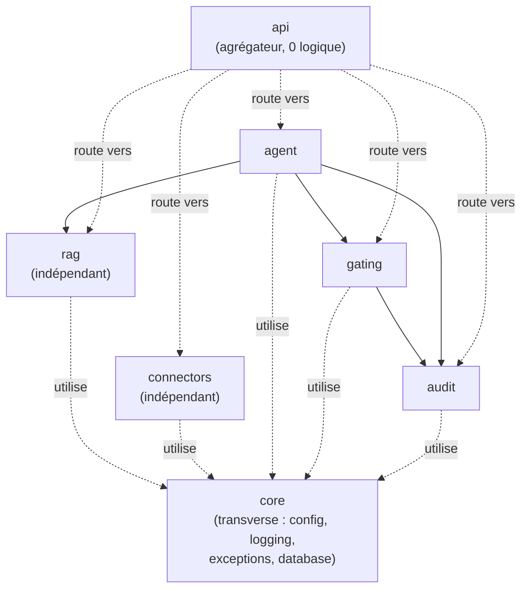
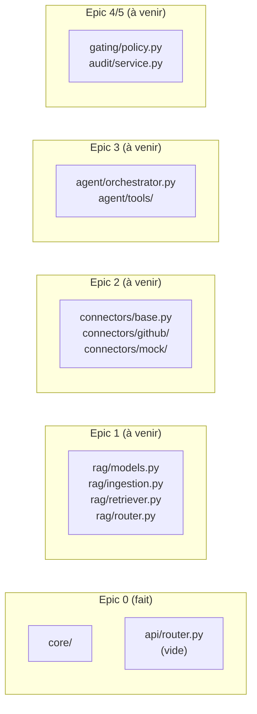

# Architecture hexagonale (ports & adapters)

## Principe

Le projet est un **monolithe modulaire**, pas un ensemble de microservices : un seul déploiement, une seule base de code, mais des frontières internes strictes entre modules. Chaque module métier (`rag`, `connectors`, `agent`, `gating`, `audit`) est un dossier isolé avec ses propres modèles, schémas et router. La règle qui rend ça tenable :

> Les dépendances entre modules ne vont que dans un sens, jamais en retour.

Ça permet de tester ou remplacer `rag` sans jamais démarrer `agent`, ou de brancher un nouveau connecteur sans toucher au reste du système.

## Graphe de dépendance



Points clés de ce graphe :
- **`connectors` et `rag` ne dépendent de rien d'autre que `core`.** On peut les développer et les tester en isolation totale — c'est exactement ce que fait le Sprint 2 (Epic 1) : un moteur RAG validable seul, sans agent ni connecteur.
- **`gating` dépend de `audit`** (une décision de validation est tracée), mais l'inverse est faux : `audit` ne sait rien de `gating`.
- **`agent` orchestre `rag`, `gating` et `audit`**, mais aucun de ces trois modules n'importe quoi que ce soit venant de `agent`. C'est la garantie qu'on peut faire évoluer l'orchestrateur sans casser le moteur de recherche.
- **`api` n'a aucune logique métier.** Son seul rôle est d'agréger les routers de chaque module (voir [07-api-main.md](07-api-main.md)).
- **`core` est transverse** : tous les modules peuvent l'utiliser (`config.py`, `core/database.py`, `core/logging.py`, `core/exceptions.py`), mais `core` n'importe jamais un module métier. C'est ce qui permet à Alembic (qui dépend de `core.database.Base`) de rester agnostique de ce que contiennent `rag` ou `gating`.

## Ce qui est en place aujourd'hui vs. ce qui viendra

À l'issue de l'Epic 0, seuls `core` et `api` ont du contenu réel. Les autres modules existent en tant que **dossiers Python valides** (`__init__.py` présent, importables) mais vides — c'est le contrat de l'US-001 : la structure existe avant le code métier, pour que chaque epic suivant n'ait qu'à remplir des fichiers, jamais à réorganiser l'arborescence.



## Comment un module s'enregistre auprès de l'API

Quand l'Epic 1 ajoutera `app/rag/router.py`, la seule modification nécessaire dans `app/api/router.py` sera :

```python
from fastapi import APIRouter

from app.rag.router import router as rag_router

router = APIRouter()
router.include_router(rag_router, prefix="/rag", tags=["rag"])
```

Aucun autre fichier de `core` ou de `main.py` n'a besoin de changer — c'est la preuve concrète que la règle de dépendance à sens unique fonctionne : ajouter un module ne modifie qu'un seul point d'agrégation.
