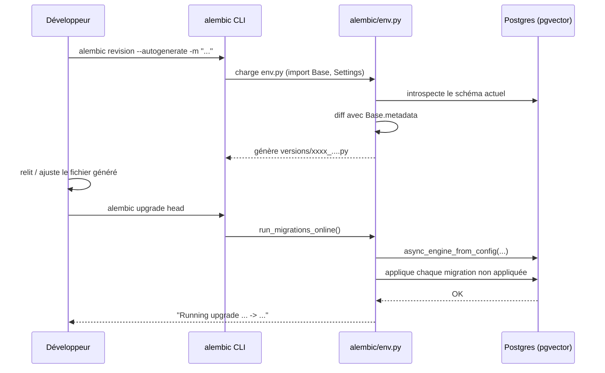

# Base de données et migrations (US-004)

## Fichier : `app/core/database.py`

```python
from collections.abc import AsyncGenerator

from sqlalchemy.ext.asyncio import AsyncSession, async_sessionmaker, create_async_engine
from sqlalchemy.orm import DeclarativeBase

from app.config import get_settings

settings = get_settings()

engine = create_async_engine(settings.database_url, echo=False)
async_session_factory = async_sessionmaker(engine, expire_on_commit=False)


class Base(DeclarativeBase):
    pass


async def get_db() -> AsyncGenerator[AsyncSession, None]:
    async with async_session_factory() as session:
        yield session
```

### Ce que fait chaque ligne

- **`create_async_engine(settings.database_url)`** : un seul engine, créé une fois à l'import du module, partagé par toute l'application (pool de connexions géré par SQLAlchemy). `echo=False` désactive le log SQL brut de SQLAlchemy (on a notre propre logging structuré, voir [05-logging-observabilite.md](05-logging-observabilite.md)).
- **`async_sessionmaker(engine, expire_on_commit=False)`** : fabrique de sessions. `expire_on_commit=False` évite qu'un objet SQLAlchemy devienne inutilisable après un `commit()` — sans ce réglage, accéder à un attribut d'un objet juste committé déclenche un aller-retour DB implicite (souvent une source de bugs `MissingGreenlet` en async).
- **`Base(DeclarativeBase)`** : la classe mère dont hériteront tous les modèles futurs (`rag.models.Document`, `gating.models.ActionProposal`, `audit.models.AuditLog`, ...). C'est `Base.metadata` qu'Alembic utilise pour détecter les tables à créer.
- **`get_db()`** : dépendance FastAPI (`Depends(get_db)`) qui ouvre une session par requête et la ferme proprement à la fin — aucun endpoint futur n'a besoin de gérer lui-même le cycle de vie d'une session.

Ce fichier ne contient **aucun modèle** : c'est la fondation transverse (`core`), les modèles concrets appartiennent à chaque module métier (Epic 1 pour `rag`, Epic 4 pour `gating`, Epic 5 pour `audit`).

## Alembic : pourquoi le template async

Le projet utilise SQLAlchemy en mode asynchrone (`asyncpg`), mais Alembic, par défaut, génère un `env.py` synchrone. On a utilisé le template dédié :

```bash
uv run alembic init -t async alembic
```

Ça génère un `env.py` qui sait faire tourner les migrations sur un engine async via `asyncio.run(...)` + `connection.run_sync(...)`. Sans ce template, il aurait fallu réécrire cette mécanique à la main.

## Fichier : `alembic/env.py` (extrait modifié)

```python
from alembic import context

from app.config import get_settings
from app.core.database import Base

config = context.config

if config.config_file_name is not None:
    fileConfig(config.config_file_name)

config.set_main_option("sqlalchemy.url", get_settings().database_url)

target_metadata = Base.metadata
```

Deux modifications par rapport au template généré :

1. **`config.set_main_option("sqlalchemy.url", get_settings().database_url)`** : plutôt que d'écrire l'URL de connexion en dur dans `alembic.ini` (ce qui obligerait à la dupliquer et à la garder synchronisée avec `.env`), Alembic va chercher la même source de vérité que le reste de l'application — `Settings`. Un seul endroit pour changer l'URL de la base, quel que soit l'environnement.
2. **`target_metadata = Base.metadata`** : sans cette ligne, `alembic revision --autogenerate` ne détecterait jamais aucune table. À partir de l'Epic 1, dès qu'un module importe ses modèles quelque part sur le chemin d'exécution d'`env.py` (directement ou via `app/core/database`), ils s'enregistrent automatiquement sur `Base.metadata` et deviennent visibles à l'autogénération.

## La migration initiale

```bash
uv run alembic revision -m "initial schema"
```

```python
def upgrade() -> None:
    """Upgrade schema."""
    pass


def downgrade() -> None:
    """Downgrade schema."""
    pass
```

Volontairement vide — conforme au critère d'acceptation de l'US-004 : *"Une migration initiale crée les tables de base (vide au départ, complétée au fur et à mesure des epics suivants)"*. Elle sert de point d'ancrage (`down_revision = None`) sur lequel toutes les migrations futures (Epic 1 : tables `Document`/`Chunk`, Epic 4 : `ActionProposal`, Epic 5 : `AuditLog`) viendront s'empiler.

## pgvector

Le RAG (Epic 1) a besoin d'un type `vector` en base pour stocker des embeddings et faire de la recherche par similarité cosinus. Plutôt qu'un service de base vectorielle séparé, le backlog choisit délibérément **pgvector**, une extension Postgres : un seul service à faire tourner en local, pas de dépendance à un fournisseur externe.

Ça implique deux choses mises en place dès l'Epic 0, même si aucune table ne l'utilise encore :

- L'image Docker est `pgvector/pgvector:pg16` (Postgres 16 + extension précompilée), pas l'image `postgres` officielle — voir [09-docker-ci-cd.md](09-docker-ci-cd.md).
- L'extension doit être activée une fois par base : `CREATE EXTENSION IF NOT EXISTS vector;`. Quand l'Epic 1 ajoutera une colonne de type `Vector(...)` (package Python `pgvector`, déjà dans `pyproject.toml`), il faudra soit l'ajouter à la migration initiale, soit — plus propre — l'activer dans la migration qui introduit la première table qui en a besoin, via `op.execute("CREATE EXTENSION IF NOT EXISTS vector")`.

## Cycle de vie d'une migration



## Commandes utiles

```bash
# Appliquer toutes les migrations en attente
uv run alembic upgrade head

# Revenir en arrière d'une migration
uv run alembic downgrade -1

# Voir l'historique
uv run alembic history

# Générer une migration à partir des modèles (à utiliser dès l'Epic 1)
uv run alembic revision --autogenerate -m "add document and chunk tables"
```

**Important** : ces commandes doivent tourner avec le même interpréteur/venv que l'application (`uv run alembic ...`, jamais un `alembic` global) — sinon `import app.config` échoue.

## Un incident de réseau, pas de base de données

En développant cette US sur cette machine Windows, `alembic upgrade head` échouait systématiquement en tentant de se connecter au Postgres exposé par Docker Desktop sur `localhost:5432`, avec une `ConnectionResetError`/`ConnectionDoesNotExistError` — alors que la base tournait et répondait bien (vérifié indépendamment). Le détail du diagnostic et la solution adoptée (faire tourner Alembic **dans** le réseau Docker via `docker compose exec api uv run alembic upgrade head`) sont documentés dans [09-docker-ci-cd.md](09-docker-ci-cd.md#incident--connexion-refusee-depuis-windows-vers-docker-desktop) — ce n'est pas un problème de configuration Alembic/SQLAlchemy, mais de port-forwarding Docker Desktop sur cette machine.
