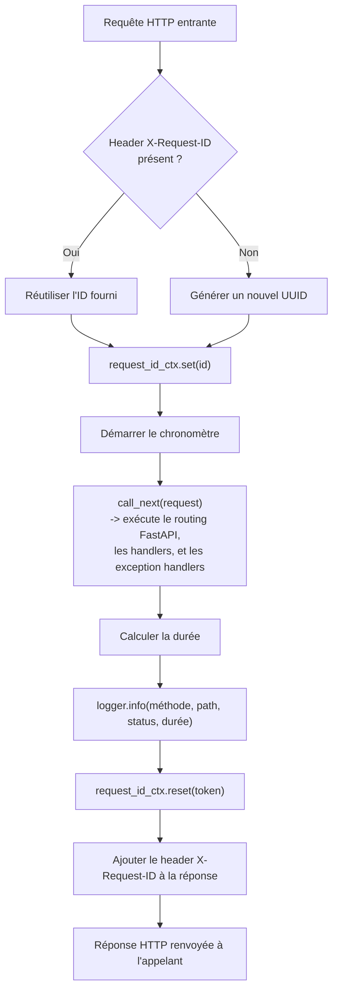

# Logging structuré (US-005)

## Fichier : `app/core/logging.py`

```python
import contextvars
import json
import logging
import time
import uuid
from collections.abc import Awaitable, Callable

from starlette.middleware.base import BaseHTTPMiddleware
from starlette.requests import Request
from starlette.responses import Response

request_id_ctx: contextvars.ContextVar[str] = contextvars.ContextVar("request_id", default="-")

logger = logging.getLogger("app")


class JSONFormatter(logging.Formatter):
    def format(self, record: logging.LogRecord) -> str:
        payload = {
            "timestamp": self.formatTime(record, "%Y-%m-%dT%H:%M:%S%z"),
            "level": record.levelname,
            "logger": record.name,
            "message": record.getMessage(),
            "request_id": request_id_ctx.get(),
        }
        if record.exc_info:
            payload["exc_info"] = self.formatException(record.exc_info)
        return json.dumps(payload)


def configure_logging(level: str = "INFO") -> None:
    handler = logging.StreamHandler()
    handler.setFormatter(JSONFormatter())
    root = logging.getLogger()
    root.handlers = [handler]
    root.setLevel(level.upper())


class RequestIDMiddleware(BaseHTTPMiddleware):
    async def dispatch(
        self, request: Request, call_next: Callable[[Request], Awaitable[Response]]
    ) -> Response:
        request_id = request.headers.get("X-Request-ID", uuid.uuid4().hex)
        token = request_id_ctx.set(request_id)
        start = time.perf_counter()
        try:
            response = await call_next(request)
        finally:
            request_id_ctx.reset(token)
        duration_ms = round((time.perf_counter() - start) * 1000, 2)
        logger.info(
            "%s %s -> %s (%sms)",
            request.method,
            request.url.path,
            getattr(response, "status_code", "?"),
            duration_ms,
        )
        response.headers["X-Request-ID"] = request_id
        return response
```

### Pourquoi un format JSON custom plutôt qu'une bibliothèque type `python-json-logger`

Le besoin est simple (timestamp, niveau, logger, message, request ID, trace d'exception éventuelle) et tient en une vingtaine de lignes sans dépendance supplémentaire. `logging.Formatter.format()` est le point d'extension standard de la stdlib — pas besoin d'ajouter un paquet pour ça.

### Pourquoi `contextvars` et pas une variable globale ou un `threading.local()`

FastAPI (via Starlette/ASGI) exécute les requêtes de façon concurrente sur un même thread grâce à `asyncio` : plusieurs requêtes peuvent être "en vol" en même temps sur le même thread, entrelacées à chaque `await`. Un `threading.local()` ne les distinguerait pas (elles partagent le même thread), et une variable globale serait écrasée par la requête suivante avant que la précédente n'ait fini de logger. `contextvars.ContextVar` est justement conçu pour ça : chaque tâche asyncio a sa propre vue de la variable, isolée des autres tâches concurrentes.

### Pourquoi un `BaseHTTPMiddleware` plutôt qu'un simple décorateur

Le request ID doit être disponible **avant** que le handler ne s'exécute (pour que tout log émis pendant le traitement de la requête, y compris par du code métier profondément imbriqué, puisse le lire via `request_id_ctx.get()`) et doit aussi être renvoyé dans la réponse HTTP (`X-Request-ID`). Un middleware ASGI est le seul point qui entoure toute la requête, de l'entrée à la sortie — un décorateur sur chaque endpoint ne le permettrait pas sans le répéter partout, et n'intercepterait pas les erreurs gérées plus haut dans la pile (voir [06-gestion-erreurs.md](06-gestion-erreurs.md)).

### Réutilisation du request ID entrant

`request.headers.get("X-Request-ID", uuid.uuid4().hex)` : si l'appelant fournit déjà un `X-Request-ID` (typiquement un reverse proxy, un load balancer, ou un appel inter-service), on le réutilise au lieu d'en générer un nouveau — ça permet de suivre une requête de bout en bout à travers plusieurs services, pas seulement à l'intérieur de celui-ci.

## Diagramme d'activité — cycle de vie d'une requête loggée



Le `reset(token)` dans un bloc `finally` garantit que le contexte est nettoyé même si `call_next` lève une exception non gérée — important pour ne pas faire fuiter le request ID d'une requête vers la suivante réutilisant la même tâche.

## Exemple de sortie

```json
{"timestamp": "2026-09-01T09:58:01+0000", "level": "INFO", "logger": "app", "message": "GET /health -> 200 (1.42ms)", "request_id": "f56bf92e0b6345f98d2de017bb5e16fc"}
```

## Vérification manuelle

```bash
curl -i http://localhost:8000/health
```

```
HTTP/1.1 200 OK
x-request-id: f56bf92e0b6345f98d2de017bb5e16fc
content-type: application/json

{"status":"ok"}
```

## Configuration du niveau de log

`configure_logging(settings.log_level)` est appelé une fois au chargement de `app/main.py`, avec le niveau lu depuis `LOG_LEVEL` dans `.env` (`DEBUG`, `INFO`, `WARNING`, ...) — voir [03-configuration.md](03-configuration.md). Changer le niveau ne nécessite aucune modification de code, seulement de `.env` (ou de la variable d'environnement du conteneur).
