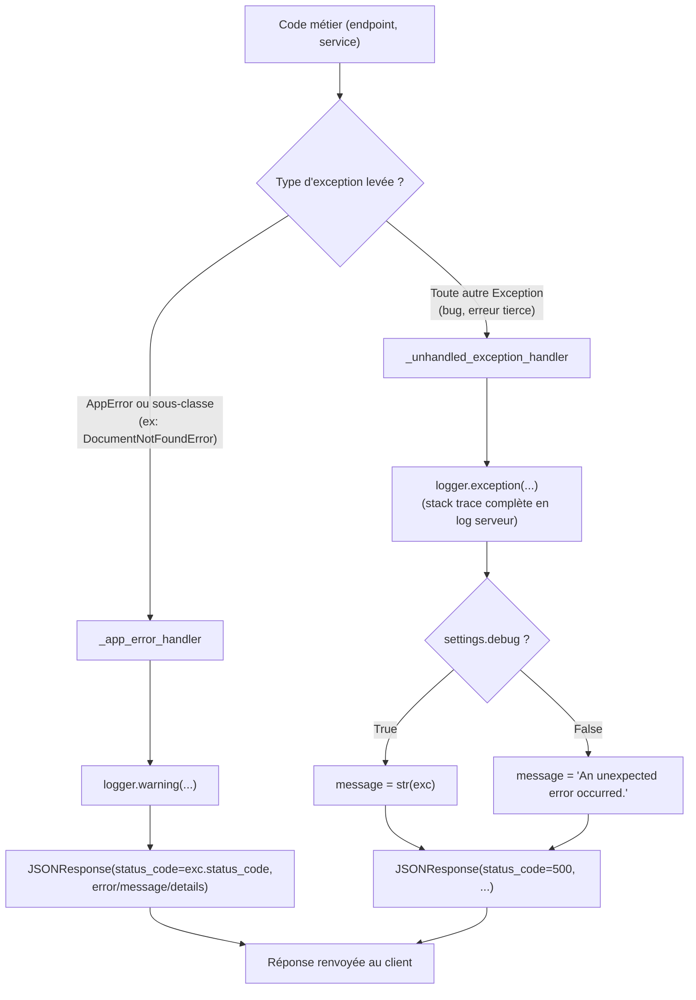

# Gestion centralisée des erreurs (US-006)

## Fichier : `app/core/exceptions.py`

```python
import logging

from fastapi import FastAPI, Request
from fastapi.responses import JSONResponse

from app.config import get_settings

logger = logging.getLogger("app")


class AppError(Exception):
    status_code = 500

    def __init__(self, message: str, *, details: dict | None = None):
        self.message = message
        self.details = details or {}
        super().__init__(message)


class DocumentNotFoundError(AppError):
    status_code = 404


class ConnectorError(AppError):
    status_code = 502


class ActionNotFoundError(AppError):
    status_code = 404


async def _app_error_handler(request: Request, exc: AppError) -> JSONResponse:
    logger.warning("%s: %s", exc.__class__.__name__, exc.message)
    return JSONResponse(
        status_code=exc.status_code,
        content={"error": exc.__class__.__name__, "message": exc.message, "details": exc.details},
    )


async def _unhandled_exception_handler(request: Request, exc: Exception) -> JSONResponse:
    logger.exception("Unhandled exception on %s %s", request.method, request.url.path)
    settings = get_settings()
    message = str(exc) if settings.debug else "An unexpected error occurred."
    return JSONResponse(
        status_code=500,
        content={"error": "InternalServerError", "message": message},
    )


def register_exception_handlers(app: FastAPI) -> None:
    app.add_exception_handler(AppError, _app_error_handler)
    app.add_exception_handler(Exception, _unhandled_exception_handler)
```

### Pourquoi une hiérarchie d'exceptions métier plutôt que `HTTPException` partout

FastAPI propose nativement `raise HTTPException(status_code=404, detail="...")`. On aurait pu s'arrêter là, mais ça mélange deux préoccupations : la sémantique métier ("ce document n'existe pas") et la représentation HTTP (404). En définissant `DocumentNotFoundError(AppError)` avec un `status_code` porté par la classe elle-même :

- le code métier reste lisible et ne connaît pas HTTP (`raise DocumentNotFoundError("document introuvable")` peut aussi bien être appelé depuis un endpoint FastAPI que depuis un test unitaire pur ou, plus tard, depuis l'orchestrateur de l'agent qui n'a rien d'HTTP) ;
- un seul endroit (`_app_error_handler`) décide comment une exception métier devient une réponse HTTP — cohérence garantie sur tous les endpoints, présents et futurs.

### Les trois sous-classes déjà présentes

Chacune anticipe un besoin identifié dans le backlog, sans implémenter la logique correspondante (qui n'existe pas encore) :

| Exception | `status_code` | Utilisée par (à venir) |
|---|---|---|
| `DocumentNotFoundError` | 404 | Epic 1 (`rag`) — un document demandé n'existe pas |
| `ConnectorError` | 502 | Epic 2 (`connectors`) — échec d'appel à une API externe (GitHub, ...) |
| `ActionNotFoundError` | 404 | Epic 4 (`gating`) — une `ActionProposal` demandée n'existe pas |

### Les deux handlers

- **`_app_error_handler`** : traduit toute `AppError` (et ses sous-classes) en JSON structuré `{"error": ..., "message": ..., "details": ...}` avec le bon code HTTP. Logué en `WARNING` (attendu, pas une panne du système).
- **`_unhandled_exception_handler`** : filet de sécurité pour tout ce qui n'est **pas** une `AppError` — un bug, une exception d'une bibliothèque tierce, etc. Logué en `ERROR` avec la stack trace complète côté serveur (`logger.exception`), mais le message renvoyé au client ne contient la vraie exception que si `settings.debug` est vrai. En production (`DEBUG=false`), le client ne voit jamais qu'"An unexpected error occurred." — c'est le critère d'acceptation de l'US-006 : *"Aucune stack trace brute n'est renvoyée au client en dehors du mode debug."*

### Ordre d'enregistrement

`register_exception_handlers(app)` enregistre `AppError` puis `Exception`. FastAPI fait correspondre l'exception levée au handler le plus spécifique — une `DocumentNotFoundError` est aussi une `AppError` donc elle est interceptée par `_app_error_handler`, jamais par le handler générique.

## Diagramme — propagation d'une exception



## Exemple d'utilisation (illustratif — Epic 1)

```python
# app/rag/router.py (à venir)
from app.core.exceptions import DocumentNotFoundError

@router.get("/documents/{document_id}")
async def get_document(document_id: str):
    document = await find_document(document_id)
    if document is None:
        raise DocumentNotFoundError(f"document {document_id} introuvable")
    return document
```

Réponse HTTP obtenue automatiquement, sans code supplémentaire dans l'endpoint :

```json
HTTP/1.1 404 Not Found
{"error": "DocumentNotFoundError", "message": "document abc123 introuvable", "details": {}}
```

## Où c'est branché

`register_exception_handlers(app)` est appelé une seule fois dans `app/main.py`, juste après la création de l'instance FastAPI — voir [07-api-main.md](07-api-main.md).
