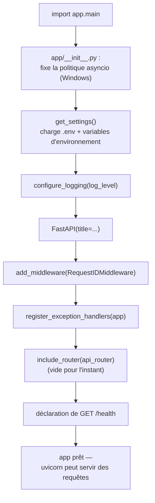

# Point d'entrée de l'API (US-001)

## Fichier : `app/main.py`

```python
from fastapi import FastAPI

from app.api.router import router as api_router
from app.config import get_settings
from app.core.exceptions import register_exception_handlers
from app.core.logging import RequestIDMiddleware, configure_logging

settings = get_settings()
configure_logging(settings.log_level)

app = FastAPI(title=settings.app_name)

app.add_middleware(RequestIDMiddleware)
register_exception_handlers(app)
app.include_router(api_router)


@app.get("/health")
async def health() -> dict[str, str]:
    return {"status": "ok"}
```

### Pourquoi cet ordre précis

1. **`settings = get_settings()` puis `configure_logging(...)`** : le logging doit être configuré avant que quoi que ce soit d'autre ne puisse logger — y compris les imports suivants ou l'instanciation de `FastAPI`.
2. **`app.add_middleware(RequestIDMiddleware)`** : les middlewares Starlette s'exécutent dans l'ordre inverse de leur ajout autour de la requête, mais comme c'est le seul middleware ici, l'important est qu'il entoure bien tout le traitement — y compris les exception handlers (voir ci-dessous).
3. **`register_exception_handlers(app)`** : doit être fait avant que des requêtes n'arrivent, mais l'ordre par rapport au middleware n'a pas d'importance en soi — FastAPI capture les exceptions des endpoints avant qu'elles ne remontent au middleware ASGI. Concrètement : une `DocumentNotFoundError` levée dans un endpoint est transformée en `JSONResponse` par `_app_error_handler` *avant* que `RequestIDMiddleware.dispatch` ne reçoive la réponse de `call_next` — le middleware voit donc toujours une réponse HTTP normale (avec le bon status code), jamais une exception qui remonte, et peut donc toujours poser le header `X-Request-ID` et logger la ligne d'accès, erreur ou non.
4. **`app.include_router(api_router)`** : monte l'agrégateur de tous les modules (actuellement vide, voir plus bas).
5. **`/health`** : déclaré directement sur `app`, pas via `api_router` — c'est un endpoint d'infrastructure (utilisé par le healthcheck Docker, un futur load balancer, etc.), pas un endpoint métier d'un module.

## Fichier : `app/api/router.py`

```python
from fastapi import APIRouter

router = APIRouter()
```

Vide aujourd'hui, et c'est voulu : *"api → agrège tous les routers, ne contient aucune logique métier"* (règle de dépendance du backlog, voir [02-architecture-hexagonale.md](02-architecture-hexagonale.md)). Dès que l'Epic 1 ajoutera `app/rag/router.py`, ce fichier deviendra :

```python
from fastapi import APIRouter

from app.rag.router import router as rag_router

router = APIRouter()
router.include_router(rag_router, prefix="/rag", tags=["rag"])
```

Et ainsi de suite pour `connectors`, `agent`, `gating`, `audit` au fil des epics — jamais de logique conditionnelle ou de traitement de requête dans ce fichier, uniquement du montage de routers.

## Fichier : `app/__init__.py`

```python
import asyncio
import sys

if sys.platform == "win32":
    asyncio.set_event_loop_policy(asyncio.WindowsSelectorEventLoopPolicy())
```

Ce fichier n'a rien à voir avec le découpage métier — c'est un correctif d'environnement, expliqué en détail dans [09-docker-ci-cd.md](09-docker-ci-cd.md). Il est placé ici (et non dans `core/`) parce qu'il doit s'exécuter **avant** tout autre import du package `app`, et `app/__init__.py` est justement le tout premier code exécuté dès qu'on écrit `from app.xxx import yyy` où que ce soit (`main.py`, `alembic/env.py`, `tests/conftest.py`).

## Diagramme d'activité — démarrage de l'application



## Vérification

```bash
uv run uvicorn app.main:app --reload
curl http://localhost:8000/health
# {"status":"ok"}
```

Testé avec succès à la fois en lancement direct sur l'hôte (`uv run uvicorn ...`) et à l'intérieur du conteneur `api` de `docker-compose.yml` — voir [09-docker-ci-cd.md](09-docker-ci-cd.md).
