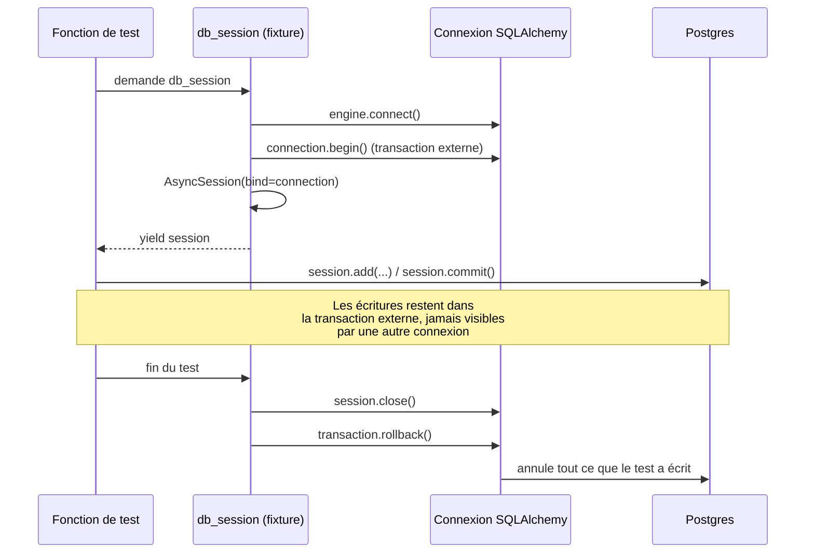

# Structure de tests (US-007)

## Fichier : `tests/conftest.py`

```python
from collections.abc import AsyncGenerator

import pytest_asyncio
from httpx import ASGITransport, AsyncClient
from sqlalchemy.ext.asyncio import AsyncSession

from app.core.database import engine
from app.main import app


@pytest_asyncio.fixture
async def db_session() -> AsyncGenerator[AsyncSession, None]:
    async with engine.connect() as connection:
        transaction = await connection.begin()
        session = AsyncSession(bind=connection, expire_on_commit=False)
        try:
            yield session
        finally:
            await session.close()
            await transaction.rollback()


@pytest_asyncio.fixture
async def client() -> AsyncGenerator[AsyncClient, None]:
    transport = ASGITransport(app=app)
    async with AsyncClient(transport=transport, base_url="http://test") as ac:
        yield ac
```

### `db_session` — pourquoi une transaction annulée après chaque test

Critère d'acceptation de l'US-007 : *"fournit une fixture de base de données de test (transaction annulée après chaque test)"*. Le mécanisme :

1. On ouvre une **connexion** brute (`engine.connect()`), pas une session directement depuis `async_session_factory`.
2. On démarre une **transaction externe** sur cette connexion (`connection.begin()`).
3. On crée une `AsyncSession` **liée à cette connexion précise** (`bind=connection`) plutôt qu'à l'engine — tout ce que le test fait via cette session (insert, update, commit inclus) se produit à l'intérieur de la transaction externe.
4. À la fin du test, on **annule** cette transaction externe (`transaction.rollback()`), quel que soit ce que le test a fait à l'intérieur (y compris s'il a lui-même appelé `session.commit()`).

Résultat : chaque test démarre sur une base propre et n'importe quelle donnée qu'il insère disparaît automatiquement, sans avoir à tout nettoyer manuellement (`DELETE FROM ...`) ni à recréer la base entre deux tests. C'est nettement plus rapide qu'un `DROP`/`CREATE` de schéma par test, et ça reste correct même si le test appelle `commit()` en pensant persister réellement.

Cette fixture n'est utilisée par aucun test aujourd'hui (aucun module ne touche encore la base), mais elle est prête pour l'Epic 1 : le premier test qui insère un `Document` et vérifie qu'une recherche le retrouve l'utilisera directement.

### `client` — pourquoi `ASGITransport` plutôt qu'un vrai serveur HTTP

`httpx.AsyncClient` avec un `ASGITransport(app=app)` appelle l'application FastAPI **directement en mémoire**, sans ouvrir de socket TCP ni démarrer un serveur uvicorn. Avantages :
- tests rapides (pas de coût réseau, pas de port à gérer, pas de risque de collision de port entre tests) ;
- fonctionne de façon identique en local et en CI, sans dépendre de la capacité de l'environnement à binder un port.

C'est la méthode recommandée par FastAPI/Starlette pour les tests d'intégration d'API.

## Fichier : `tests/test_health.py`

```python
from httpx import AsyncClient


async def test_health(client: AsyncClient) -> None:
    response = await client.get("/health")

    assert response.status_code == 200
    assert response.json() == {"status": "ok"}
```

Test trivial demandé par l'US-007 — il valide que toute la chaîne (app FastAPI, middleware, routing) fonctionne de bout en bout, sans dépendre de la base de données.

## Configuration pytest — `pyproject.toml`

```toml
[tool.pytest.ini_options]
pythonpath = ["."]
asyncio_mode = "auto"
testpaths = ["tests"]
```

- **`pythonpath = ["."]`** : permet `from app.xxx import yyy` dans les tests sans installer le projet comme paquet (cohérent avec `[tool.uv] package = false`, voir [10-choix-bibliotheques.md](10-choix-bibliotheques.md)).
- **`asyncio_mode = "auto"`** : toute fonction de test `async def` est automatiquement reconnue et exécutée par `pytest-asyncio`, sans avoir à ajouter `@pytest.mark.asyncio` sur chaque test.
- **`testpaths = ["tests"]`** : `pytest` (sans argument) ne cherche que dans `tests/`, pas dans `app/` ou `alembic/`.

## Arborescence des tests, en miroir de `app/`

```
tests/
├── conftest.py
├── test_health.py
├── rag/            # vide, Epic 1
├── connectors/      # vide, Epic 2
├── agent/           # vide, Epic 3
└── gating/          # vide, Epic 4
```

Chaque sous-dossier a un `__init__.py` et attend les tests du module correspondant — même logique que pour `app/` : la structure existe avant le contenu, pour qu'ajouter un test d'un nouveau module epic n'implique jamais de réorganisation.

## Diagramme — cycle de vie de `db_session` dans un test



## Exemple futur (illustratif — Epic 1)

```python
# tests/rag/test_retriever.py (à venir)
async def test_search_returns_relevant_chunk(db_session):
    document = Document(source="test", content="FastAPI est un framework async")
    db_session.add(document)
    await db_session.commit()

    results = await search(db_session, query="framework Python", top_k=1)

    assert results[0].document_id == document.id
```

## Lancer les tests

```bash
# Dans le réseau Docker (contourne le souci réseau Windows, voir 09-docker-ci-cd.md)
docker compose exec api uv run pytest

# En local, une fois la base migrée
uv run pytest
```

```
tests/test_health.py::test_health PASSED                                 [100%]
1 passed in 0.13s
```
