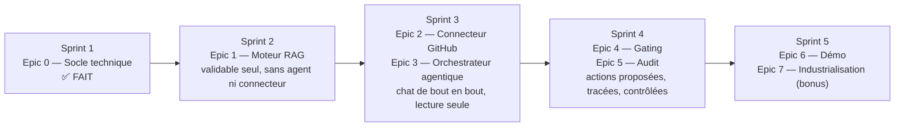

# Prochaines étapes

## Ordre d'exécution du backlog

## Décision en attente : Epic 1 (moteur RAG)

L'implémentation du RAG (US-101 à US-107) est bloquée sur un choix qui n'est pas dans le backlog : **le fournisseur d'embeddings**. Deux options ont été proposées et la décision est en attente :

| Option | Avantage | Coût |
|---|---|---|
| API OpenAI (`text-embedding-3-small`) | Simple, qualité éprouvée | Nécessite une clé API, appel réseau à chaque ingestion/recherche |
| Modèle local (`sentence-transformers`, ex. `all-MiniLM-L6-v2`) | Aucune clé API, aucun coût par appel | Dépendance plus lourde (poids du modèle, éventuellement GPU), latence au premier chargement |

Ce choix impacte directement `rag/ingestion.py` (US-103) : la fonction d'appel au modèle d'embedding doit être isolée dans un point unique, remplaçable (critère d'acceptation explicite de l'US-103) — quel que soit le choix, le reste du module (`chunk_text`, `retriever.search`) n'en dépend pas.

## Ce qui viendra dans chaque module, epic par epic

### Epic 1 — `rag/` (Sprint 2)

- `models.py` : `Document`, `Chunk` (avec colonne `vector` via `pgvector`)
- `ingestion.py` : `chunk_text(text, max_tokens, overlap)`, génération d'embeddings
- `retriever.py` : `search(query, top_k) -> list[Chunk]` (similarité cosinus)
- `vector_store.py` : abstraction sur pgvector
- `router.py` : `POST /rag/ingest`, `GET /rag/search`
- Migration Alembic : première vraie migration (tables `documents`, `chunks`), activation de `CREATE EXTENSION vector`
- Tests dans `tests/rag/`, utilisant la fixture `db_session` déjà en place

### Epic 2 — `connectors/` (Sprint 3)

- `base.py` : interface abstraite `Connector` (`fetch_items()`, `to_document()`)
- `registry.py` : registre des connecteurs disponibles
- `github/connector.py` : lecture des issues GitHub (pagination, rate limiting)
- `mock/connector.py` : connecteur factice pour les tests
- `router.py` : `POST /connectors/{name}/sync`, réutilise le pipeline d'ingestion de l'Epic 1

### Epic 3 — `agent/` (Sprint 3)

- `orchestrator.py` : boucle agentique (function calling), plafond d'itérations
- `llm_client.py` : wrapper remplaçable autour de l'API LLM (mockable en test)
- `memory.py` : historique de conversation
- `tools/search_knowledge.py` : appelle `rag.retriever.search()`
- `router.py` : `POST /agent/chat` en streaming SSE

### Epic 4 — `gating/` (Sprint 4)

- `models.py` : `ActionProposal` (statut `pending`/`approved`/`rejected`/`executed`)
- `policy.py` : `evaluate(action_type, confidence) -> Decision`
- `queue_service.py`, `router.py` : `GET /gating/pending`, `POST /gating/{id}/decide`
- Nouvelle exception à utiliser : `ActionNotFoundError` (déjà définie dans `core/exceptions.py`, voir [06-gestion-erreurs.md](06-gestion-erreurs.md))

### Epic 5 — `audit/` (Sprint 4)

- `models.py` : `AuditLog`
- `service.py` : `write_log(event_type, payload)`, point de passage obligé pour `agent` et `gating`
- `router.py` : `GET /audit/logs`

### Epic 6 — Démo (Sprint 5)

- Interface minimale (Streamlit ou HTML/JS) pour discuter avec l'agent
- Tableau de la file de validation (`gating`)

### Epic 7 — Industrialisation, bonus (Sprint 5)

- `core/security.py` : authentification par clé API (le fichier n'existe pas encore — volontairement pas créé en Epic 0 puisqu'aucun endpoint n'en a besoin avant l'US-701)
- Rate limiting sur `/agent/chat`
- Dockerfile de production (multi-stage, sans volumes de dev)
- Second connecteur (Jira/Zendesk) pour prouver la portabilité de l'architecture

## Points de vigilance pour la suite

- **Enregistrer les modèles auprès d'Alembic** : dès qu'un module ajoute `models.py` (Epic 1, 4, 5), s'assurer qu'il est importé quelque part sur le chemin d'exécution d'`alembic/env.py` pour que `Base.metadata` le voie — sinon `alembic revision --autogenerate` ne détectera pas les nouvelles tables. Voir [04-base-de-donnees-migrations.md](04-base-de-donnees-migrations.md).
- **Réutiliser, ne pas dupliquer** : plusieurs US du backlog insistent explicitement là-dessus (US-203 réutilise l'ingestion de l'US-102/103, US-303 réutilise le retriever de l'US-104, US-402 configure via `.env` plutôt que coder en dur). Le socle Epic 0 (config centralisée, exceptions communes, `get_db()` unique) existe justement pour que ces réutilisations soient triviales.
- **Networking Windows/Docker** : si une nouvelle dépendance a besoin de parler à Postgres depuis l'hôte (et pas seulement depuis un conteneur), le contournement documenté dans [09-docker-ci-cd.md](09-docker-ci-cd.md) (`docker compose exec api ...`) reste la solution la plus fiable sur cette machine.
