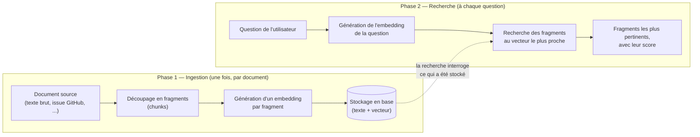
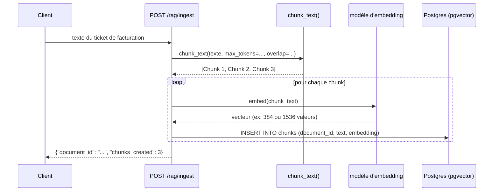
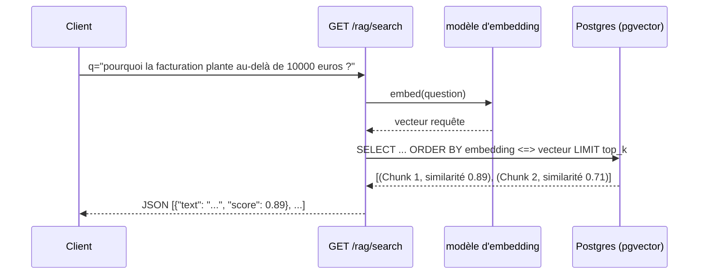

# Comprendre le RAG avant de coder l'Epic 1

## À qui s'adresse ce document

À quiconque veut comprendre ce qui va être construit dans l'Epic 1 (US-101 à US-107 du [backlog](../../management/backlog.md)) **avant** que le code n'existe. Aucun prérequis en machine learning n'est supposé : chaque notion est expliquée avec une analogie, un exemple réel ou un calcul concret avant d'être reliée au code qui sera écrit. Un glossaire récapitulatif est disponible en fin de document.

Ce document ne contient pas encore de vrai code (rien n'est implémenté) — il explique les **concepts** et la **structure prévue**, pour que la lecture du code, une fois écrit, soit une formalité plutôt qu'une découverte.

## Sommaire

1. [Le problème que le RAG résout](#1-le-problème-que-le-rag-résout)
2. [Les deux phases du RAG](#2-les-deux-phases-du-rag)
3. [Le RAG dans de vrais produits](#3-le-rag-dans-de-vrais-produits)
4. [Ce que l'Epic 1 construit (et ce qu'il ne construit pas)](#4-ce-que-lepic-1-construit-et-ce-quil-ne-construit-pas)
5. [Le découpage en fragments (chunking)](#5-le-découpage-en-fragments-chunking)
6. [Les embeddings, expliqués simplement](#6-les-embeddings-expliqués-simplement)
7. [Calcul réel de similarité cosinus, pas à pas](#7-calcul-réel-de-similarité-cosinus-pas-à-pas)
8. [La recherche par similarité avec pgvector](#8-la-recherche-par-similarité-avec-pgvector)
9. [Deux exemples complets de bout en bout](#9-deux-exemples-complets-de-bout-en-bout)
10. [Les fichiers qui vont être créés](#10-les-fichiers-qui-vont-être-créés)
11. [Comment ça se branche sur l'existant (Epic 0)](#11-comment-ça-se-branche-sur-lexistant-epic-0)
12. [Décision retenue : quel fournisseur d'embeddings](#12-décision-retenue--quel-fournisseur-dembeddings)
13. [Glossaire](#13-glossaire)
14. [Et après ce document ?](#14-et-après-ce-document-)

---

## 1. Le problème que le RAG résout

Un LLM (le modèle qui génère du texte) a deux limites structurelles :

- **Il ne connaît que ce qu'il a vu à l'entraînement.** Il ignore vos documents privés — vos issues GitHub, vos tickets internes, votre documentation métier — puisqu'ils n'ont jamais fait partie de son entraînement.
- **Il peut halluciner.** Face à une question sur un sujet qu'il ne connaît pas précisément, un LLM a tendance à produire une réponse plausible mais fausse, plutôt que d'admettre qu'il ne sait pas.

**RAG** signifie *Retrieval-Augmented Generation* — génération augmentée par la recherche. L'idée : avant de demander au LLM de répondre, on va chercher dans une base de connaissances les passages les plus pertinents par rapport à la question, et on les fournit au LLM comme contexte. Le LLM répond alors *en s'appuyant sur ces passages*, plutôt qu'en inventant.

**Analogie** : un LLM sans RAG est un expert qui répond de mémoire, même sur des sujets qu'il n'a jamais étudiés. Un LLM avec RAG est le même expert, mais qui commence par consulter une bibliothèque pertinente avant de répondre.

## 2. Les deux phases du RAG

Un système RAG fonctionne toujours en deux temps bien distincts :



La phase 1 (ingestion) se fait une fois par document, en amont. La phase 2 (recherche) se fait à chaque question posée, en quelques millisecondes si tout est déjà indexé.

## 3. Le RAG dans de vrais produits

Le RAG n'est pas une technique de laboratoire : c'est le mécanisme derrière la plupart des assistants IA qui répondent à partir de *vos* données plutôt que de connaissances générales. Voir où il est déjà utilisé aide à comprendre pourquoi on le construit ici.

| Produit | Ce qu'il recherche | Pourquoi le RAG |
|---|---|---|
| **ChatGPT (recherche web)** | Pages web pertinentes pour la question posée | Le modèle seul ne connaît pas l'actualité après sa date d'entraînement ; le RAG lui donne des pages fraîches à lire avant de répondre |
| **GitHub Copilot Chat** | Fichiers et définitions de fonctions du dépôt ouvert dans l'éditeur | Le code d'un dépôt privé n'a jamais été vu à l'entraînement ; Copilot doit chercher le contexte pertinent (fichiers liés, symboles) avant de répondre sur *votre* code |
| **Perplexity AI** | Index de pages web, mis à jour en continu | Chaque réponse doit être vérifiable et sourcée — Perplexity affiche les passages web utilisés, exactement comme un score de similarité affiché à côté d'un fragment |
| **Notion AI ("Poser une question")** | Pages et blocs de l'espace de travail Notion de l'utilisateur | Les notes personnelles/d'équipe sont privées et changent en permanence — impossible de les avoir "apprises" à l'entraînement |
| **Intercom Fin / Zendesk AI Agents** | Articles du centre d'aide de l'entreprise | Un bot de support doit répondre avec la politique *actuelle* de l'entreprise (remboursement, procédure), pas une politique générique inventée |
| **Glean (recherche d'entreprise)** | Slack, Confluence, Google Drive, Jira d'une entreprise | Répondre à "quelle est notre politique de congés ?" nécessite de chercher dans des documents internes strictement privés |
| **Cursor / Windsurf (IDE agentiques)** | Fragments de code du dépôt ouvert, indexés par embeddings locaux | Même logique que Copilot Chat : trouver le bon fragment de code avant de répondre ou de modifier un fichier |

**Le point commun à tous ces exemples** : le modèle ne "sait" rien par lui-même sur les données privées de l'utilisateur — un moteur de recherche par similarité va chercher les passages pertinents à chaque question, puis les fournit au modèle comme contexte. C'est exactement le schéma de la section précédente, appliqué à des sources différentes (pages web, code, tickets de support, wiki d'entreprise).

**Notre POC suit le même patron**, à plus petite échelle : le premier connecteur branché (Epic 2) sera **GitHub Issues** — conceptuellement, c'est la même chose que Glean qui indexe Confluence, ou que Copilot qui indexe un dépôt de code. Une fois le moteur RAG de l'Epic 1 validé avec des documents ingérés manuellement (`POST /rag/ingest`), brancher GitHub Issues ne change rien au moteur de recherche lui-même — seule la source des documents change.

## 4. Ce que l'Epic 1 construit (et ce qu'il ne construit pas)

C'est le point le plus important à avoir en tête avant de lire la suite : **l'Epic 1 construit uniquement le moteur de recherche (phases 1 et 2 de la section 2), pas le LLM qui génère une réponse en langage naturel à partir des fragments trouvés.**

Le backlog est explicite là-dessus — critère d'acceptation de l'US-106 :

> *"Un endpoint de recherche RAG isolé (**sans agent ni LLM de génération**), afin de valider le moteur de récupération indépendamment du reste."*

Concrètement, à la fin de l'Epic 1, on pourra faire :

```bash
curl "http://localhost:8000/rag/search?q=pourquoi+la+facturation+plante&top_k=3"
```

et récupérer les 3 fragments de texte les plus pertinents avec leur score — mais **aucune phrase générée par un LLM**. C'est l'Epic 3 (`agent`) qui, plus tard, prendra ces fragments et les donnera à un LLM pour rédiger une réponse en langage naturel (exactement comme Perplexity affiche à la fois une réponse rédigée *et* les sources brutes utilisées). Découper le travail ainsi permet de valider que le moteur de recherche fonctionne (des résultats pertinents, dans le bon ordre) sans dépendre d'un LLM, d'une clé API de chat, ou d'un orchestrateur — exactement l'esprit de l'architecture hexagonale déjà en place (voir [02-architecture-hexagonale.md](../epic-0/02-architecture-hexagonale.md)) : `rag` ne dépend de rien d'autre.

## 5. Le découpage en fragments (chunking)

### Pourquoi ne pas stocker le document entier tel quel

- Les modèles d'embedding ont une limite de taille en entrée (quelques centaines à quelques milliers de *tokens*, voir glossaire).
- Même sans cette limite : l'embedding d'un document entier "moyenne" le sens de tout son contenu. Un document de 10 pages parlant de 5 sujets différents produirait un vecteur flou, mauvais pour retrouver un passage précis sur un seul de ces sujets.
- À l'inverse, un fragment trop petit (une phrase isolée) perd le contexte et devient ambigu.

Le bon compromis est un **fragment de taille raisonnable** (quelques centaines de tokens), avec un **chevauchement (overlap)** entre fragments consécutifs pour qu'une information à cheval sur une coupure ne soit pas perdue dans les deux morceaux.

### Exemple concret

Texte source (fictif, un ticket de support) :

> "Le service de facturation renvoie une erreur 500 quand le montant dépasse 10 000 €. La cause identifiée est un dépassement du champ DECIMAL(8,2) en base de données. Le correctif consiste à migrer ce champ vers DECIMAL(12,2) et à rejouer les factures en échec depuis la file d'attente."

Découpé avec une taille max de ~20 mots et un chevauchement de ~5 mots :

```
Chunk 1 : "Le service de facturation renvoie une erreur 500 quand le montant
           dépasse 10 000 €. La cause identifiée est un dépassement du champ"

Chunk 2 : "un dépassement du champ DECIMAL(8,2) en base de données. Le correctif
           consiste à migrer ce champ vers DECIMAL(12,2) et à rejouer les factures"

Chunk 3 : "vers DECIMAL(12,2) et à rejouer les factures en échec depuis la file
           d'attente."
```

Remarquez que "un dépassement du champ" apparaît à la fois en fin de Chunk 1 et en début de Chunk 2 : c'est le chevauchement, qui garantit qu'une recherche sur "dépassement du champ DECIMAL" retrouve un fragment cohérent, même si cette expression était pile à la frontière d'une coupure.

C'est exactement ce que fera `chunk_text(text, max_tokens, overlap)` (US-102) — une fonction **pure** (aucun appel réseau, aucune base de données), donc facilement testable avec des cas limites (texte plus court que `max_tokens`, texte vide).

### Un vrai exemple de tokenisation

Un token n'est **pas** un mot entier — c'est une unité plus fine, souvent un morceau de mot. Avec le tokenizer `cl100k_base` (utilisé par les modèles OpenAI type GPT-4/embeddings v3), la phrase :

> "Le service de facturation renvoie une erreur 500."

se découpe réellement en 12 tokens : `["Le", " service", " de", " fact", "uration", " renvoie", " une", " erreur", " ", "500", "."]` (approximativement — le détail exact dépend de la version du tokenizer). Remarquez que **"facturation" devient deux tokens** (`fact` + `uration`) : c'est pour ça que la limite d'un modèle s'exprime en tokens, pas en mots — un texte truffé de mots composés ou rares consomme plus de tokens qu'un texte simple de même longueur apparente.

## 6. Les embeddings, expliqués simplement

Un **embedding** est une liste de nombres (un *vecteur*, par exemple 384 ou 1536 valeurs selon le modèle) qui représente le *sens* d'un texte plutôt que ses caractères. Un modèle d'embedding est entraîné de telle sorte que :

- deux textes de sens proche produisent des vecteurs proches dans cet espace à N dimensions,
- deux textes de sens éloigné produisent des vecteurs éloignés.

**Exemple imagé** (les vraies valeurs ont des centaines de dimensions, ici simplifiées à 2 pour l'intuition) :

```
"chat"    → [0.91, 0.12]
"chaton"  → [0.89, 0.15]   ← proche de "chat" : sens voisin
"voiture" → [-0.40, 0.83]  ← loin de "chat" : sens différent
```

On ne "comprend" pas ce que chaque dimension représente individuellement — ce n'est pas interprétable comme "dimension 1 = félinité". Ce qui compte, c'est la **distance relative** entre les vecteurs.

### Pourquoi c'est le point de variation isolé

Le modèle qui génère ces vecteurs peut être un appel à une API externe (OpenAI, par exemple) ou un modèle qui tourne localement sur la machine (`sentence-transformers`). Une fois le vecteur produit, **le reste du pipeline ne sait pas d'où il vient** — il stocke et compare des nombres, point. C'est pour ça que le backlog demande explicitement (critère d'acceptation de l'US-103) que l'appel au modèle d'embedding soit *"isolé dans une fonction facilement remplaçable (changer de fournisseur ne touche qu'un seul point)"*. On y revient en détail en [section 12](#12-décision-retenue--quel-fournisseur-dembeddings).

## 7. Calcul réel de similarité cosinus, pas à pas

Les vrais embeddings ont 384 ou 1536 dimensions — impossible à calculer à la main. Mais la formule, elle, est simple et **exactement** celle que pgvector exécute en SQL. Pour la rendre concrète, voici un calcul complet avec des vecteurs "jouets" à 5 dimensions (valeurs choisies pour l'exemple, pas générées par un vrai modèle — mais le calcul lui-même est réel et vérifiable à la calculatrice).

Trois phrases, réduites à des vecteurs à 5 dimensions :

| Phrase | Vecteur |
|---|---|
| A : "Le service de paiement échoue" | `[0.80, 0.10, 0.30, -0.20, 0.40]` |
| B : "La transaction de paiement plante" | `[0.75, 0.15, 0.28, -0.18, 0.35]` |
| C : "Le café est excellent ce matin" | `[-0.30, 0.90, -0.10, 0.60, -0.50]` |

### La formule

```
similarité(X, Y) = (X · Y) / (‖X‖ × ‖Y‖)
```

où `X · Y` est le produit scalaire (somme des produits terme à terme) et `‖X‖` la norme (racine carrée de la somme des carrés).

### Calcul pour A et B (phrases proches en sens)

**Produit scalaire** :
```
A·B = (0.80×0.75) + (0.10×0.15) + (0.30×0.28) + (-0.20×-0.18) + (0.40×0.35)
    = 0.600 + 0.015 + 0.084 + 0.036 + 0.140
    = 0.875
```

**Normes** :
```
‖A‖ = √(0.80² + 0.10² + 0.30² + 0.20² + 0.40²) = √0.940 = 0.9695
‖B‖ = √(0.75² + 0.15² + 0.28² + 0.18² + 0.35²) = √0.8183 = 0.9046
```

**Similarité cosinus** :
```
cos(A, B) = 0.875 / (0.9695 × 0.9046) = 0.875 / 0.8772 ≈ 0.997
```

**≈ 0,997**, très proche de 1 : deux phrases qui reformulent la même idée ("paiement qui échoue") obtiennent une similarité quasi maximale, malgré des mots complètement différents ("service"/"transaction", "échoue"/"plante").

### Calcul pour A et C (phrases sans rapport)

```
A·C = (0.80×-0.30) + (0.10×0.90) + (0.30×-0.10) + (-0.20×0.60) + (0.40×-0.50)
    = -0.240 + 0.090 - 0.030 - 0.120 - 0.200
    = -0.500

‖C‖ = √(0.30² + 0.90² + 0.10² + 0.60² + 0.50²) = √1.520 = 1.2329

cos(A, C) = -0.500 / (0.9695 × 1.2329) = -0.500 / 1.1954 ≈ -0.418
```

**≈ -0,418** : une phrase sur le café n'a aucun rapport sémantique avec une phrase sur un paiement qui échoue — le score le reflète (proche de 0, voire négatif ici puisque les vecteurs sont volontairement construits pour pointer dans des directions opposées).

### Ce que pgvector calcule à la place de vous

L'opérateur `<=>` de pgvector renvoie la **distance** cosinus, c'est-à-dire `1 - similarité` :

| Paire | Similarité cosinus | Distance pgvector (`<=>`) | Interprétation |
|---|---|---|---|
| A, B | 0,997 | 0,003 | Quasiment identiques en sens → remonteraient ensemble dans une recherche |
| A, C | -0,418 | 1,418 | Aucun rapport → C ne remonterait jamais pour une requête sur "paiement" |

C'est très exactement ce que fait la requête SQL de la [section 8](#8-la-recherche-par-similarité-avec-pgvector) : trier tous les chunks stockés par distance croissante à la question posée, et ne garder que les `top_k` premiers.

## 8. La recherche par similarité avec pgvector

**pgvector** est une extension PostgreSQL qui ajoute :

- un type de colonne `vector(N)` (N = nombre de dimensions, fixé par le modèle d'embedding utilisé),
- des opérateurs pour comparer des vecteurs directement en SQL.

Le backlog demande la **similarité cosinus** (US-104), qui mesure l'angle entre deux vecteurs plutôt que leur distance brute — deux vecteurs pointant dans la même direction sont considérés similaires même si l'un est "plus long" que l'autre. C'est la mesure standard pour comparer des embeddings de texte. En SQL, avec pgvector, ça ressemble à :

```sql
SELECT chunk_text, 1 - (embedding <=> :query_embedding) AS similarity
FROM chunks
ORDER BY embedding <=> :query_embedding
LIMIT :top_k;
```

- `<=>` est l'opérateur de **distance** cosinus de pgvector (0 = identiques, 2 = opposés) — plus la distance est petite, plus les textes sont proches en sens. C'est le calcul de la section 7, exécuté directement par Postgres.
- `1 - distance` convertit cette distance en un **score de similarité** plus intuitif (1 = identiques, 0 = aucun rapport) — c'est ce score que l'US-106 demande de renvoyer au client, à côté de chaque fragment.
- `ORDER BY ... LIMIT :top_k` : Postgres trie tous les fragments par proximité et ne renvoie que les `top_k` plus proches — exactement la fonction `retriever.search(query, top_k)` de l'US-104.

Pour un POC avec un nombre modeste de documents, une recherche exacte (sans index spécialisé) est largement assez rapide. pgvector propose aussi des index approximatifs (`IVFFlat`, `HNSW`) pour accélérer la recherche sur des millions de vecteurs — hors du périmètre du POC, mais bon à savoir si le volume grandit un jour.

## 9. Deux exemples complets de bout en bout

### Exemple 1 — Support technique (ticket de facturation)

Reprise de l'exemple des sections 5 et 7 : le document est un ticket, les chunks sont ceux calculés en section 5.





La question ("pourquoi la facturation plante au-delà de 10000 euros ?") ne contient presque aucun mot en commun avec le Chunk 1 ("erreur 500 quand le montant dépasse 10 000 €") — et pourtant elles sont sémantiquement proches, exactement comme A et B dans le calcul de la section 7. C'est ce que les embeddings apportent par rapport à une recherche par mots-clés classique : ils rapprochent des formulations différentes qui *veulent dire la même chose*.

### Exemple 2 — Connecteur GitHub Issues (le premier cas d'usage réel du POC)

Ce deuxième exemple correspond à ce que fera vraiment le POC une fois l'Epic 2 branché sur l'Epic 1 — c'est le fil rouge de tout le projet, décrit dans la vision du backlog.

**Document source** (une issue GitHub réelle, simplifiée) :

> **Issue #482 — "Timeout sur l'upload de fichiers > 50 Mo"**
> "Les utilisateurs signalent que l'upload échoue silencieusement pour les fichiers de plus de 50 Mo. Après investigation : le timeout du reverse proxy nginx est fixé à 30 secondes, insuffisant pour les gros fichiers sur une connexion lente. Solution appliquée en v2.3 : `proxy_read_timeout` porté à 300s et upload par chunks côté client."

**Ingestion** (Epic 2 appelle le pipeline de l'Epic 1, sans le réimplémenter — US-203) :
- Le connecteur GitHub (`connectors/github/connector.py`) récupère l'issue via l'API GitHub, la transforme en `DocumentIn` (titre + corps + commentaires résolus).
- `POST /connectors/github/sync` envoie ce document au pipeline d'ingestion RAG déjà construit en Epic 1 — `chunk_text()` puis génération d'embeddings, sans code dupliqué.

**Recherche**, plusieurs mois plus tard, un autre développeur tape :

```bash
curl "http://localhost:8000/rag/search?q=les+gros+fichiers+n'uploadent+pas&top_k=3"
```

Le fragment de l'issue #482 remonte en premier résultat, avec un score de similarité élevé — bien que la question ne mentionne ni "timeout", ni "nginx", ni "50 Mo". C'est la valeur concrète du RAG pour ce projet : retrouver une solution déjà documentée dans les issues GitHub, formulée avec d'autres mots, sans qu'un humain se souvienne du numéro d'issue ni des mots-clés exacts utilisés à l'époque.

## 10. Les fichiers qui vont être créés

| Fichier | User story | Rôle |
|---|---|---|
| `app/rag/models.py` | US-101 | Modèles SQLAlchemy `Document` et `Chunk` (dont la colonne `vector`) |
| `app/rag/ingestion.py` | US-102, US-103 | `chunk_text(...)` (pure, sans I/O) + génération des embeddings (isolée, remplaçable) |
| `app/rag/retriever.py` | US-104 | `search(query, top_k) -> list[Chunk]`, la recherche par similarité |
| `app/rag/vector_store.py` | US-104 | Abstraction sur pgvector, pour ne pas coupler `retriever.py` aux détails SQL |
| `app/rag/router.py` | US-105, US-106 | `POST /rag/ingest`, `GET /rag/search` |
| `alembic/versions/xxxx_add_rag_tables.py` | US-101 | Première vraie migration : crée les tables `documents` et `chunks` |
| `tests/rag/test_ingestion.py`, `tests/rag/test_retriever.py` | US-107 | Cas limites du chunking, pertinence de la recherche |

Ordre d'implémentation logique (chaque étape dépend de la précédente) : **US-101 → US-102 → US-103 → US-104 → US-105/106 → US-107**.

## 11. Comment ça se branche sur l'existant (Epic 0)

Rien de ce qui a été construit dans l'Epic 0 ne sera modifié — l'Epic 1 vient uniquement remplir des fichiers aujourd'hui vides, en réutilisant les fondations transverses :

- **`app/rag/models.py` héritera de `Base`** (`app/core/database.py`, voir [04-base-de-donnees-migrations.md](../epic-0/04-base-de-donnees-migrations.md)) — dès que ce fichier existera et sera importé sur le chemin d'`alembic/env.py`, `Base.metadata` verra les nouvelles tables et `alembic revision --autogenerate` pourra générer la migration automatiquement.
- **`app/rag/router.py` sera monté dans `app/api/router.py`** avec `router.include_router(rag_router, prefix="/rag", tags=["rag"])` — voir [02-architecture-hexagonale.md](../epic-0/02-architecture-hexagonale.md) et [07-api-main.md](../epic-0/07-api-main.md). C'est la seule modification nécessaire en dehors du dossier `rag/`.
- **Chaque endpoint recevra la session DB via `Depends(get_db)`** (`app/core/database.py`) — aucun endpoint n'ouvre ou ne ferme sa propre connexion.
- **La configuration (`chunk_max_tokens`, `chunk_overlap`, éventuellement `embedding_provider`/`embedding_model`) s'ajoutera à `Settings`** (`app/config.py`, voir [03-configuration.md](../epic-0/03-configuration.md)) — de nouveaux champs, mais le même mécanisme (variables d'environnement, `.env.example` mis à jour).
- **`DocumentNotFoundError` existe déjà** dans `app/core/exceptions.py` (voir [06-gestion-erreurs.md](../epic-0/06-gestion-erreurs.md)), prête à être levée si un futur endpoint demande un document par identifiant.
- **Les tests réutiliseront la fixture `db_session`** déjà en place dans `tests/conftest.py` (transaction annulée après chaque test, voir [08-tests.md](../epic-0/08-tests.md)) — aucune nouvelle fixture à écrire pour ça.

## 12. Décision retenue : quel fournisseur d'embeddings

> **Décision prise : modèle local (MiniLM).** Le détail complet — toutes les classes Python, le code, les diagrammes — est dans [01-modele-local-minilm.md](01-modele-local-minilm.md). Cette section reste en place pour documenter l'arbitrage qui a mené à ce choix.

Elle influence un point précis (la fonction d'embedding dans `ingestion.py`) mais a des conséquences concrètes qu'il fallait connaître avant de trancher.

| | API OpenAI (`text-embedding-3-small`) | Modèle local (`sentence-transformers`, ex. `all-MiniLM-L6-v2`) |
|---|---|---|
| Clé API nécessaire | Oui | Non |
| Coût | Quelques centimes pour des milliers de tokens | Gratuit à l'usage |
| Dépendance réseau | Un appel HTTP par embedding généré | Aucune, tout tourne en local |
| Dimension du vecteur | 1536 | 384 (pour `all-MiniLM-L6-v2`) |
| Installation | Aucune, juste une clé API | Télécharge un modèle (quelques centaines de Mo) au premier lancement |
| Vitesse | Dépend de la latence réseau | Dépend du CPU (correct pour un POC, sans GPU) |
| Reproductibilité | Nécessite que la clé reste valide/financée | Fonctionne offline, indéfiniment |

### Un détail important, pas juste une question de préférence

La **dimension du vecteur** (1536 vs 384) doit être fixée dans la définition de la colonne pgvector (`vector(1536)` ou `vector(384)`) — c'est un choix qui se fige dans la migration Alembic. Changer de fournisseur *après coup* n'est pas qu'un changement de configuration : ça implique une nouvelle migration pour changer le type de la colonne, et de **ré-ingérer tous les documents** (les anciens embeddings, dans l'autre dimension, ne sont pas compatibles). Ce n'est pas bloquant pour un POC, mais c'est pour ça que la fonction d'embedding doit être isolée dès le départ (US-103) : le jour où on change d'avis, l'impact reste localisé.

Aucune des deux options n'est "meilleure" dans l'absolu — c'est un arbitrage clé API/coût réseau contre poids/CPU local. La décision reste à prendre avant d'écrire `ingestion.py` (US-103) ; tout le reste du pipeline (chunking, stockage, recherche) est strictement identique quel que soit le choix.

## 13. Glossaire

| Terme | Définition |
|---|---|
| **Document** | Contenu source complet avant découpage (un fichier texte, une issue GitHub avec son corps et ses commentaires, ...) |
| **Chunk / fragment** | Portion découpée d'un document, de taille raisonnable, unité de stockage et de recherche |
| **Token** | Unité de découpage du texte utilisée par les modèles (grossièrement un mot ou un sous-mot, pas un caractère — voir l'exemple de tokenisation en section 5) |
| **Embedding** | Vecteur de nombres représentant le sens d'un texte ; deux textes de sens proche ont des embeddings proches |
| **Dimension** | Nombre de valeurs dans un vecteur d'embedding (ex. 384, 1536) — fixé par le modèle utilisé |
| **Similarité cosinus** | Mesure de proximité entre deux vecteurs basée sur leur angle : `(X·Y)/(‖X‖×‖Y‖)` (1 = identiques, 0 = aucun rapport) |
| **Distance cosinus** | `1 - similarité cosinus` ; c'est ce que calcule l'opérateur `<=>` de pgvector |
| **top-k** | Nombre de résultats les plus pertinents à renvoyer pour une recherche (ex. top-5) |
| **pgvector** | Extension PostgreSQL ajoutant un type `vector` et des opérateurs de distance/similarité |
| **Index vectoriel (IVFFlat, HNSW)** | Structure accélérant la recherche par similarité sur de gros volumes ; pas nécessaire pour un POC |
| **Overlap (chevauchement)** | Portion de texte répétée entre deux chunks consécutifs, pour ne pas perdre d'information à la frontière |
| **RAG** | *Retrieval-Augmented Generation* — enrichir la réponse d'un LLM avec des passages recherchés dans une base de connaissances |

## 14. Et après ce document ?

1. ~~Trancher la décision~~ Décision prise : modèle local — voir [section 12](#12-décision-retenue--quel-fournisseur-dembeddings) et le détail complet dans [01-modele-local-minilm.md](01-modele-local-minilm.md).
2. Développement dans l'ordre indiqué en [section 10](#10-les-fichiers-qui-vont-être-créés) : `models.py` → `ingestion.py` → `retriever.py` → `router.py` → migration Alembic → tests.
3. Validation de l'US-106 : un `curl GET /rag/search?q=...` qui renvoie des fragments pertinents, sans qu'aucun module `agent` n'existe encore.

Chaque fichier, une fois écrit, sera documenté dans ce même dossier (`docs/epic-1/`) suivant le même principe que l'Epic 0 : code réel, expliqué ligne par ligne, avec le pourquoi de chaque choix.
