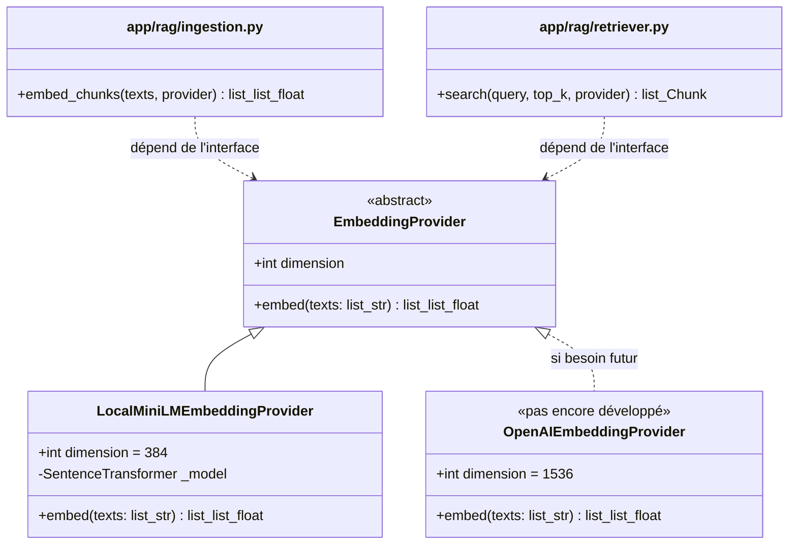
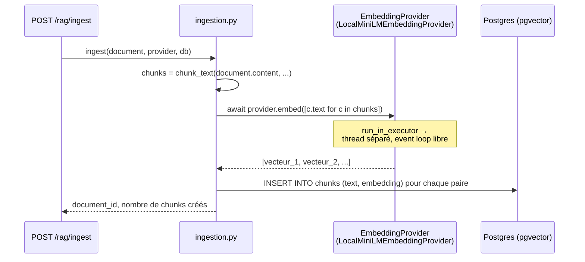
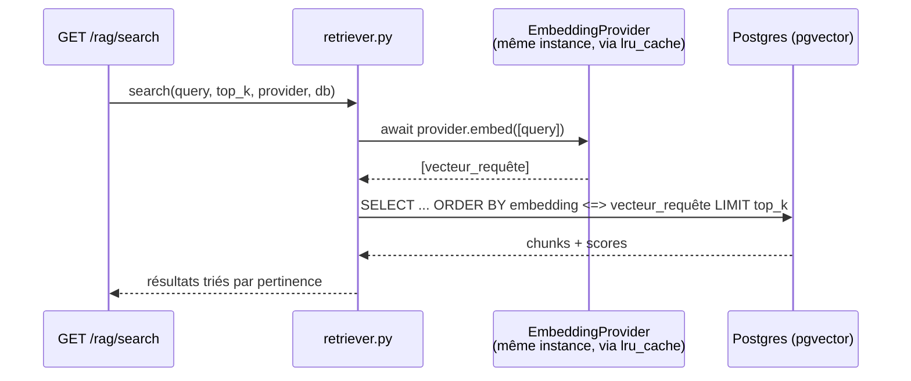

# Modèle d'embedding local — MiniLM (spécification détaillée)

## Objectif de ce document

Ce document formalise le choix du **modèle local (MiniLM)** comme fournisseur d'embeddings pour l'Epic 1 (la décision tranchée dans la [section 12 du guide précédent](00-guide-debutant-rag.md#12-décision-retenue--quel-fournisseur-dembeddings)), et détaille **toutes les classes Python qui seront écrites** pour l'implémenter — leur code complet, ligne par ligne, avant que le développement ne commence réellement. C'est la spécification qui sera suivie au moment d'écrire `app/rag/embeddings/`.

Rien n'est encore codé dans `app/` à ce stade — ce document est la spec, pas l'implémentation.

## Sommaire

1. [Clarification de vocabulaire : LLM vs modèle d'embedding](#1-clarification-de-vocabulaire--llm-vs-modèle-dembedding)
2. [Qu'est-ce que MiniLM (`all-MiniLM-L6-v2`)](#2-quest-ce-que-minilm-all-minilm-l6-v2)
3. [La bibliothèque `sentence-transformers`](#3-la-bibliothèque-sentence-transformers)
4. [Architecture logicielle retenue](#4-architecture-logicielle-retenue)
5. [Les classes, en détail](#5-les-classes-en-détail)
6. [Comment `ingestion.py` et `retriever.py` utiliseront ce provider](#6-comment-ingestionpy-et-retrieverpy-utiliseront-ce-provider)
7. [Contrainte critique : un seul modèle pour tout le cycle de vie des données](#7-contrainte-critique--un-seul-modèle-pour-tout-le-cycle-de-vie-des-données)
8. [Dépendances à ajouter](#8-dépendances-à-ajouter)
9. [Docker : cache du modèle et taille d'image](#9-docker--cache-du-modèle-et-taille-dimage)
10. [Configuration (`.env.example`)](#10-configuration-envexample)
11. [Récapitulatif des fichiers](#11-récapitulatif-des-fichiers)
12. [Et ensuite ?](#12-et-ensuite-)

---

## 1. Clarification de vocabulaire : LLM vs modèle d'embedding

Avant d'aller plus loin, une précision qui évite une confusion fréquente : **MiniLM n'est pas un LLM conversationnel**. Le projet va en réalité utiliser deux catégories de modèles bien distinctes, à deux moments différents du backlog :

| | Modèle d'embedding (ce document) | LLM conversationnel (Epic 3) |
|---|---|---|
| Rôle | Transforme un texte en vecteur de nombres | Génère une réponse en langage naturel |
| Entrée | Un texte (une phrase, un fragment) | Une conversation (question + contexte + historique) |
| Sortie | Un vecteur (ex. 384 nombres) | Du texte rédigé |
| Exemple dans ce projet | **MiniLM** (`all-MiniLM-L6-v2`, local) | Claude, via `LLM_API_KEY`/`LLM_MODEL` dans `Settings` |
| Utilisé par | `app/rag/` (Epic 1, ce document) | `app/agent/llm_client.py` (Epic 3, pas encore développé) |
| Analogie | Un système qui range des livres dans une bibliothèque par thème, sans les "comprendre" au sens conversationnel | Le bibliothécaire qui lit les livres trouvés et rédige une réponse |

MiniLM ne "répond" jamais à une question et ne rédige aucune phrase — il ne fait que produire un vecteur à partir d'un texte. C'est un modèle beaucoup plus petit et spécialisé qu'un LLM comme Claude ou GPT, et il tourne très bien sur un CPU de machine de développement, sans carte graphique.

## 2. Qu'est-ce que MiniLM (`all-MiniLM-L6-v2`)

`all-MiniLM-L6-v2` est un modèle publié par le projet [sentence-transformers](https://www.sbert.net/) (UKP Lab), disponible librement sur le Hugging Face Hub sous le nom `sentence-transformers/all-MiniLM-L6-v2`.

| Caractéristique | Valeur |
|---|---|
| Architecture | Transformer distillé, 6 couches (le "L6" du nom) |
| Dérivé de | MiniLM (Microsoft), une architecture conçue pour être petite mais performante |
| Paramètres | ~22 millions (à comparer aux ~110 millions d'un BERT-base, ou aux dizaines de milliards d'un LLM conversationnel) |
| Taille sur disque | ~80-90 Mo |
| Dimension du vecteur produit | **384** |
| Longueur maximale d'entrée | 256 tokens (au-delà, le texte est tronqué silencieusement — voir section 7) |
| Licence | Apache 2.0 (utilisation commerciale libre) |
| Entraînement | Plus d'un milliard de paires de phrases (apprentissage contrastif : rapprocher les paires similaires, éloigner les paires dissimilaires) |
| Usage visé | Similarité sémantique, recherche, clustering — exactement le besoin de l'US-104 |

**"Mini" et "distillé"** signifie que ce modèle a été entraîné à imiter le comportement d'un modèle plus gros (un processus appelé *distillation*), pour obtenir l'essentiel de la qualité sémantique avec une fraction du poids et du temps de calcul. Concrètement : encoder une phrase courte prend quelques millisecondes sur un CPU de laptop, sans configuration particulière — largement suffisant pour un POC qui ingère et interroge un volume modeste de documents.

## 3. La bibliothèque `sentence-transformers`

C'est la bibliothèque Python qui charge le modèle et expose une API simple pour l'encoder :

```python
from sentence_transformers import SentenceTransformer

model = SentenceTransformer("all-MiniLM-L6-v2")
vectors = model.encode(["Le paiement échoue", "La transaction plante"])
# vectors est un numpy.ndarray de forme (2, 384)
```

Ce qu'elle fait pour vous, en une seule ligne (`model.encode(...)`) :

1. **Tokenisation** : découpe chaque texte en tokens comme le modèle les attend.
2. **Passage dans le réseau de neurones** (inférence) : produit un vecteur par token.
3. **Pooling** : combine les vecteurs de tous les tokens d'une phrase en **un seul** vecteur de 384 valeurs (moyenne pondérée par l'attention — le détail exact importe peu pour l'usage qu'on en fait).
4. **Normalisation optionnelle** : ramène le vecteur à une longueur de 1 (voir encadré plus bas).

Au premier appel à `SentenceTransformer("all-MiniLM-L6-v2")`, la bibliothèque télécharge le modèle depuis le Hugging Face Hub et le met en cache localement (par défaut dans `~/.cache/huggingface`) — les appels suivants réutilisent ce cache, aucun réseau n'est nécessaire ensuite. Voir la [section 9](#9-docker--cache-du-modèle-et-taille-dimage) pour l'impact en conteneur.

### Pourquoi normaliser les vecteurs (`normalize_embeddings=True`)

```python
model.encode(texts, normalize_embeddings=True)
```

Un vecteur normalisé a une longueur (norme) de 1. Sans effet sur la similarité cosinus elle-même (qui est déjà indépendante de la longueur des vecteurs, voir le calcul de la [section 7 du guide précédent](00-guide-debutant-rag.md#7-calcul-réel-de-similarité-cosinus-pas-à-pas)), mais ça garantit une cohérence stricte de tous les vecteurs stockés, et ça permettrait, si un jour la performance de la recherche devenait critique, de basculer sur l'opérateur de produit scalaire de pgvector (`<#>`, plus rapide à calculer que `<=>`) sans rien changer côté stockage. Retenu comme choix par défaut dans `LocalMiniLMEmbeddingProvider` (section 5.2).

## 4. Architecture logicielle retenue

Le backlog exige (critère d'acceptation de l'US-103) que l'appel au modèle d'embedding soit *"isolé dans une fonction facilement remplaçable (changer de fournisseur ne touche qu'un seul point)"*. On applique ici exactement le même patron que celui déjà prévu pour les connecteurs (`connectors.base.Connector`, Epic 2, voir [11-prochaines-etapes.md](../epic-0/11-prochaines-etapes.md)) : une **interface abstraite (port)**, et une **implémentation concrète (adapter)** — MiniLM aujourd'hui, potentiellement OpenAI demain, sans jamais toucher au code appelant.



`ingestion.py` et `retriever.py` ne connaîtront que le type `EmbeddingProvider` — jamais `SentenceTransformer` ni `LocalMiniLMEmbeddingProvider` directement. C'est ce découplage qui rend le changement de fournisseur "un seul point" : le jour où `OpenAIEmbeddingProvider` existera, seule la fonction qui *choisit quelle implémentation instancier* changera (section 5.3), pas le code qui *utilise* l'embedding.

## 5. Les classes, en détail

### 5.1 `EmbeddingProvider` — l'interface abstraite

**Fichier : `app/rag/embeddings/base.py`**

```python
from abc import ABC, abstractmethod


class EmbeddingProvider(ABC):
    dimension: int

    @abstractmethod
    async def embed(self, texts: list[str]) -> list[list[float]]:
        ...
```

**Explication** :

- **`ABC` (Abstract Base Class)** : empêche d'instancier `EmbeddingProvider` directement (`EmbeddingProvider()` lève une erreur) — on ne peut créer qu'une sous-classe qui implémente réellement `embed()`. C'est le même mécanisme qui sera utilisé pour `connectors.base.Connector` (Epic 2).
- **`dimension: int`** : chaque implémentation doit déclarer la dimension du vecteur qu'elle produit (384 pour MiniLM). C'est cette valeur qui sera lue au moment de définir la colonne `vector(N)` dans `models.py` (section 5.5) — un seul endroit d'où part la cohérence dimensionnelle de tout le pipeline.
- **`async def embed(...)`** : la méthode est déclarée `async` dès l'interface, même si l'implémentation locale (MiniLM) n'a *elle-même* rien d'asynchrone (c'est du calcul CPU pur). C'est un choix délibéré : `ingestion.py` et `retriever.py` sont des fonctions `async` (cohérence avec le reste de l'application FastAPI/SQLAlchemy async) et appellent `await provider.embed(...)` sans jamais savoir si l'implémentation sous-jacente est vraiment asynchrone (un appel réseau vers OpenAI) ou seulement du calcul local — l'interface reste identique dans les deux cas.
- **`texts: list[str] -> list[list[float]]`** : l'interface travaille **par lot** (une liste de textes en entrée, une liste de vecteurs en sortie), jamais un texte à la fois. Un document découpé en 20 chunks ne fait ainsi qu'un seul appel à `embed()`, pas 20 — voir section 5.2 pour pourquoi c'est important en performance.

### 5.2 `LocalMiniLMEmbeddingProvider` — l'implémentation MiniLM

**Fichier : `app/rag/embeddings/local.py`**

```python
import asyncio

from sentence_transformers import SentenceTransformer

from app.rag.embeddings.base import EmbeddingProvider


class LocalMiniLMEmbeddingProvider(EmbeddingProvider):
    dimension = 384

    def __init__(self, model_name: str = "all-MiniLM-L6-v2") -> None:
        self._model = SentenceTransformer(model_name)

    async def embed(self, texts: list[str]) -> list[list[float]]:
        loop = asyncio.get_running_loop()
        vectors = await loop.run_in_executor(None, self._encode, texts)
        return vectors.tolist()

    def _encode(self, texts: list[str]):
        return self._model.encode(texts, normalize_embeddings=True)
```

**Explication ligne par ligne** :

- **`__init__` charge le modèle une seule fois** (`SentenceTransformer(model_name)`), au moment de la création de l'instance — pas à chaque appel à `embed()`. Charger le modèle prend une à quelques secondes (chargement des poids en mémoire, plus le téléchargement au tout premier lancement) ; le refaire à chaque requête HTTP rendrait l'API extrêmement lente. Voir section 5.3 pour comment on garantit qu'une seule instance existe pour toute la durée de vie de l'application.
- **Pourquoi `run_in_executor` et pas un simple appel direct** : `self._model.encode(...)` est une fonction **synchrone et bloquante** (calcul CPU pur, aucun `await` à l'intérieur). Toute l'application (FastAPI/uvicorn) tourne sur une seule boucle d'événements `asyncio` — si on appelait `self._model.encode(...)` directement dans une fonction `async`, ça **bloquerait tout le serveur** (plus aucune autre requête traitée) pendant toute la durée de l'encodage, même pour des requêtes n'ayant rien à voir avec le RAG. `loop.run_in_executor(None, ...)` délègue l'appel à un thread séparé (le pool de threads par défaut de Python, `None` signifie "utiliser l'executor par défaut"), pendant que la boucle d'événements continue de traiter d'autres requêtes en parallèle.
- **`_encode` est une méthode séparée**, non-async, qui fait le travail réel — nécessaire parce que `run_in_executor` attend une fonction synchrone ordinaire à exécuter dans le thread, pas une coroutine.
- **`.tolist()`** : `model.encode(...)` renvoie un tableau `numpy.ndarray`. SQLAlchemy/pgvector attendent une liste Python de nombres flottants (`list[float]`) pour chaque vecteur — `.tolist()` fait cette conversion.
- **`normalize_embeddings=True`** : voir l'encadré de la section 3.

### 5.3 La fabrique (factory) — choisir et mettre en cache le provider

**Fichier : `app/rag/embeddings/__init__.py`**

```python
from functools import lru_cache

from app.config import get_settings
from app.rag.embeddings.base import EmbeddingProvider
from app.rag.embeddings.local import LocalMiniLMEmbeddingProvider


@lru_cache
def get_embedding_provider() -> EmbeddingProvider:
    settings = get_settings()
    if settings.embedding_provider == "local":
        return LocalMiniLMEmbeddingProvider(model_name=settings.embedding_model)
    raise ValueError(f"Fournisseur d'embeddings inconnu : {settings.embedding_provider}")
```

**Explication** :

- **C'est le "point unique" exigé par l'US-103.** Aujourd'hui, une seule branche (`"local"`). Le jour où `OpenAIEmbeddingProvider` sera développé, une seconde branche `elif settings.embedding_provider == "openai": return OpenAIEmbeddingProvider(...)` suffira — aucun autre fichier du projet n'aura besoin de changer.
- **`@lru_cache`**, exactement le même principe que `get_settings()` (voir [03-configuration.md](../epic-0/03-configuration.md)) : la première fois qu'on appelle `get_embedding_provider()`, ça instancie `LocalMiniLMEmbeddingProvider(...)` (donc charge le modèle) ; tous les appels suivants, dans toute l'application, renvoient **la même instance déjà chargée** — un seul chargement du modèle pour toute la durée de vie du processus, quel que soit le nombre de requêtes HTTP traitées.
- **Usage dans un endpoint** (illustratif, Epic 1) :

```python
from fastapi import Depends

from app.rag.embeddings import EmbeddingProvider, get_embedding_provider


@router.post("/ingest")
async def ingest_document(
    payload: DocumentIn,
    provider: EmbeddingProvider = Depends(get_embedding_provider),
    db: AsyncSession = Depends(get_db),
):
    ...
```

FastAPI accepte une fonction normale (pas seulement une coroutine) comme dépendance `Depends(...)` — `get_embedding_provider` est appelée à chaque requête, mais grâce à `@lru_cache`, elle ne fait vraiment le travail (charger le modèle) qu'une seule fois.

### 5.4 Extension de `Settings` (`app/config.py`)

Nouveaux champs, ajoutés à la classe `Settings` existante (voir [03-configuration.md](../epic-0/03-configuration.md)) — aucune autre partie de `config.py` ne change :

```python
embedding_provider: str = Field(default="local", alias="EMBEDDING_PROVIDER")
embedding_model: str = Field(default="all-MiniLM-L6-v2", alias="EMBEDDING_MODEL")
```

Remarquez qu'il n'y a **pas** de champ `embedding_dimension` dans `Settings` : la dimension (384) est une propriété du *code* (`LocalMiniLMEmbeddingProvider.dimension`), pas de la *configuration* — elle ne doit pas pouvoir être changée indépendamment du modèle réellement chargé (changer `EMBEDDING_DIMENSION=1536` dans `.env` sans changer de modèle produirait une incohérence silencieuse). C'est un choix delibéré : une seule source de vérité pour la dimension, celle que le provider déclare lui-même.

### 5.5 Extension de `Chunk` (`app/rag/models.py`, US-101)

Aperçu de comment la dimension se propage jusqu'à la table (détail complet de `models.py` traité dans un prochain document dédié à l'US-101) :

```python
from pgvector.sqlalchemy import Vector
from sqlalchemy.orm import Mapped, mapped_column

from app.core.database import Base
from app.rag.embeddings.local import LocalMiniLMEmbeddingProvider


class Chunk(Base):
    __tablename__ = "chunks"

    id: Mapped[int] = mapped_column(primary_key=True)
    text: Mapped[str]
    embedding: Mapped[list[float]] = mapped_column(Vector(LocalMiniLMEmbeddingProvider.dimension))
```

`Vector(LocalMiniLMEmbeddingProvider.dimension)` plutôt que `Vector(384)` en dur : si demain la constante change dans `local.py` (improbable, mais explicite), la définition de la table suit automatiquement — un seul endroit d'où la valeur "384" est réellement définie.

### 5.6 `FakeEmbeddingProvider` — pour les tests (US-107)

**Fichier : `tests/rag/fakes.py`**

```python
import hashlib

from app.rag.embeddings.base import EmbeddingProvider


class FakeEmbeddingProvider(EmbeddingProvider):
    dimension = 8

    async def embed(self, texts: list[str]) -> list[list[float]]:
        return [self._fake_vector(text) for text in texts]

    def _fake_vector(self, text: str) -> list[float]:
        digest = hashlib.sha256(text.encode()).digest()[: self.dimension]
        return [byte / 255 for byte in digest]
```

**Pourquoi une fausse implémentation plutôt que le vrai modèle dans les tests** :

- **Vitesse** : charger le vrai `SentenceTransformer` prend plusieurs secondes ; avec des dizaines de tests, ça ralentit toute la suite. `FakeEmbeddingProvider` est instantané.
- **Déterminisme lisible** : `hashlib.sha256(text)` produit toujours le même vecteur pour le même texte, sans dépendre d'un vrai modèle de langage — pratique pour écrire des assertions simples (ex. "le chunk contenant exactement ce texte doit ressortir en premier"), sans avoir à connaître le comportement sémantique réel de MiniLM.
- **`dimension = 8`** plutôt que 384 : les tests qui utilisent ce fake doivent créer leurs propres tables/colonnes de test à la bonne dimension (ou utiliser une base de test dédiée) — un détail à trancher au moment d'écrire l'US-107, mentionné ici pour que la classe soit déjà connue.
- Un test d'intégration séparé (plus lent, marqué différemment, ex. `@pytest.mark.slow`) pourra utiliser le vrai `LocalMiniLMEmbeddingProvider` pour vérifier une fois que le vrai modèle est correctement branché — sans faire tourner tous les autres tests dessus.

## 6. Comment `ingestion.py` et `retriever.py` utiliseront ce provider





Ni `ingestion.py` ni `retriever.py` n'importeront jamais `sentence_transformers` ou `LocalMiniLMEmbeddingProvider` directement — uniquement le type `EmbeddingProvider` (pour l'annotation de type) et `get_embedding_provider` (pour l'obtenir via `Depends(...)`).

## 7. Contrainte critique : un seul modèle pour tout le cycle de vie des données

Un point qui n'est pas une option de design mais une contrainte mathématique incontournable : **le vecteur d'un chunk stocké et le vecteur d'une question ne sont comparables que s'ils viennent du même modèle d'embedding.** Deux modèles différents ne partagent pas le même espace vectoriel — comparer un vecteur MiniLM (384 dimensions) à un vecteur OpenAI (1536 dimensions) n'a aucun sens mathématique, et même deux modèles produisant la même dimension par coïncidence donneraient des résultats sans rapport.

Conséquences concrètes à garder en tête :

- **Changer `EMBEDDING_MODEL` dans `.env` après avoir déjà ingéré des documents rend la base incohérente** : les nouveaux chunks utiliseraient un modèle différent de ceux déjà stockés, sans qu'aucune erreur ne soit levée (la colonne accepte toujours un `vector(384)` si la dimension coïncide) — juste des résultats de recherche silencieusement dégradés ou absurdes. Il faut ré-ingérer tous les documents existants après un tel changement.
- **Chaque texte tronqué à 256 tokens** (limite de MiniLM, section 2) perd silencieusement tout ce qui dépasse — c'est une raison de plus, en complément du chunking (US-102), de garder des fragments courts : un chunk qui dépasse déjà 256 tokens serait tronqué une seconde fois par le modèle lui-même, invisible pour le développeur si `chunk_max_tokens` n'est pas choisi en cohérence avec cette limite.

## 8. Dépendances à ajouter

Dans `pyproject.toml`, section `[project].dependencies` :

```toml
"sentence-transformers>=3.0",
"pgvector>=0.5",  # déjà présent depuis l'Epic 0
```

`sentence-transformers` entraîne plusieurs dépendances transitives importantes à connaître :

| Dépendance transitive | Rôle | Impact |
|---|---|---|
| `torch` (PyTorch) | Moteur d'inférence du réseau de neurones | La plus grosse dépendance ajoutée — build CPU (pas de CUDA), plusieurs centaines de Mo |
| `transformers` (Hugging Face) | Chargement du modèle et tokenisation | Modérée |
| `huggingface_hub` | Téléchargement et cache du modèle | Légère |
| `numpy` | Manipulation des vecteurs | Déjà une dépendance transitive de SQLAlchemy/pgvector |

Sur cette machine (Windows, pas de GPU), `uv` résout automatiquement la variante CPU de `torch` depuis PyPI — pas de configuration supplémentaire nécessaire, mais bon à savoir que c'est la variante la plus légère qui est installée (une variante CUDA pèserait plusieurs Go de plus, inutile ici).

## 9. Docker : cache du modèle et taille d'image

Deux impacts concrets sur ce qui a été mis en place à l'Epic 0 ([09-docker-ci-cd.md](../epic-0/09-docker-ci-cd.md)) :

### Taille de l'image

L'ajout de `torch` + `transformers` va significativement alourdir l'image `api` (plusieurs centaines de Mo à ~1 Go supplémentaires). Pas bloquant pour un POC, mais à surveiller si l'image doit un jour être déployée sur une infrastructure à bande passante limitée (voir US-703, Epic 7, qui prévoit déjà une image de production optimisée séparée).

### Cache du modèle : éviter de le re-télécharger à chaque build

Par défaut, le modèle est mis en cache dans `~/.cache/huggingface` **à l'intérieur du conteneur**. Sans précaution, ce cache disparaît à chaque fois que l'image est reconstruite, et le modèle est re-téléchargé au premier démarrage. Deux options, dans `Dockerfile` :

```dockerfile
RUN python -c "from sentence_transformers import SentenceTransformer; SentenceTransformer('all-MiniLM-L6-v2')"
```

Ajoutée après `uv sync`, cette ligne télécharge et met le modèle en cache **au moment du build de l'image**, une fois pour toutes — le conteneur démarre alors instantanément, sans dépendre du réseau au premier lancement. C'est l'option recommandée ici : reproductible, pas de surprise réseau au démarrage.

Alternative pour le développement local (rebuilds fréquents) : monter `~/.cache/huggingface` en volume nommé dans `docker-compose.yml`, pour que le cache survive aux reconstructions de l'image sans le figer dans l'image elle-même — utile en cours de développement, moins pour une image destinée à être distribuée.

## 10. Configuration (`.env.example`)

Deux nouvelles variables, ajoutées à la section existante (voir [03-configuration.md](../epic-0/03-configuration.md)) :

```dotenv
# Embeddings (Epic 1 — RAG)
EMBEDDING_PROVIDER=local
EMBEDDING_MODEL=all-MiniLM-L6-v2
```

Pas de variable pour la dimension (384) — voir la justification en section 5.4.

## 11. Récapitulatif des fichiers

| Fichier | Contenu |
|---|---|
| `app/rag/embeddings/base.py` | Interface `EmbeddingProvider` |
| `app/rag/embeddings/local.py` | `LocalMiniLMEmbeddingProvider` |
| `app/rag/embeddings/__init__.py` | `get_embedding_provider()` (fabrique + cache) |
| `app/config.py` | + `embedding_provider`, `embedding_model` |
| `app/rag/models.py` | `Chunk.embedding` typé `Vector(LocalMiniLMEmbeddingProvider.dimension)` |
| `tests/rag/fakes.py` | `FakeEmbeddingProvider` |
| `Dockerfile` | + pré-téléchargement du modèle au build |
| `.env.example` | + `EMBEDDING_PROVIDER`, `EMBEDDING_MODEL` |
| `pyproject.toml` | + `sentence-transformers` |

## 12. Et ensuite ?

Ce document couvre uniquement la brique "embeddings" (US-103). Le reste de l'Epic 1 suit l'ordre déjà défini dans le [guide précédent](00-guide-debutant-rag.md#10-les-fichiers-qui-vont-être-créés) : `models.py` (US-101, qui référence maintenant `LocalMiniLMEmbeddingProvider.dimension` comme montré en section 5.5) → `ingestion.py` (US-102, `chunk_text`, puis US-103 en s'appuyant sur les classes de ce document) → `retriever.py` (US-104) → `router.py` (US-105/106) → tests (US-107, avec `FakeEmbeddingProvider`).

Prochaine étape concrète : écrire réellement `app/rag/embeddings/base.py` et `app/rag/embeddings/local.py` tels que spécifiés en section 5, puis les brancher dans `pyproject.toml` et vérifier qu'un premier appel manuel à `get_embedding_provider().embed(["test"])` renvoie bien un vecteur de 384 flottants.
