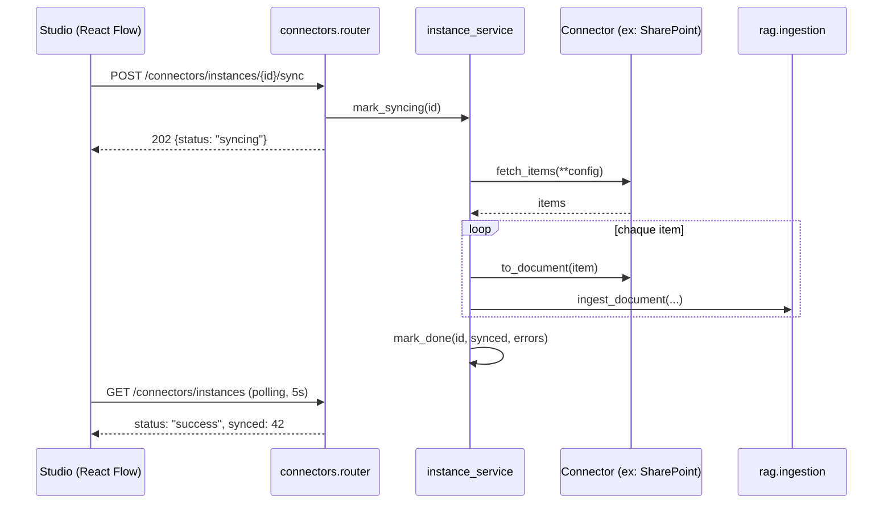

# Proposition — Epic 8 : Studio de connecteurs (interface graphique drag-and-drop)

**Statut** : validé — développement démarré (voir section 8 pour les décisions actées).

## Résumé exécutif

Aujourd'hui, brancher une source de données sur le RAG (GitHub Issues, ou toute nouvelle source) passe uniquement par `POST /connectors/{name}/sync`, appelé à la main (curl/Swagger) avec des paramètres qui ne sont jamais mémorisés. Ce document propose un **Studio de connecteurs** : un canvas graphique dans `/demo`, où on glisse-dépose un type de source (Document, GitHub Issues, SharePoint, …) sur un schéma en forme de diagramme d'activité, on le relie à l'Orchestrateur, on le configure via un formulaire généré automatiquement, et on déclenche/suit sa synchronisation — sans jamais toucher au code. SharePoint sert de cas d'école pour valider que l'architecture proposée généralise à une vraie source d'entreprise, pas seulement à GitHub.

Ce n'est pas une réécriture : le pipeline RAG (chunking, embeddings, `pgvector`), l'interface `Connector` (Epic 2) et la SPA React/Tailwind (Epic 6) sont réutilisés tels quels. L'ajout principal est une couche de **connecteurs configurables et persistés** (au lieu de connecteurs statiques appelés à l'aveugle) et son pilotage visuel.

---

## 1. Constat — état actuel

| Aujourd'hui | Limite |
|---|---|
| `connectors/registry.py` contient un dictionnaire figé (`github`, `mock`), un connecteur = une instance unique au niveau code | Impossible d'avoir deux dépôts GitHub différents, ou un futur site SharePoint, sans écrire du code à chaque fois |
| `POST /connectors/{name}/sync` reçoit `params` en JSON libre, jamais validé avant `fetch_items(**params)`, jamais mémorisé | Aucune trace de "quelle config a été utilisée la dernière fois", rien à afficher dans une UI |
| Aucun endpoint ne décrit les paramètres attendus par un connecteur | Une UI ne peut pas générer de formulaire dynamiquement |
| Le seul moyen d'ajouter une source est `curl` ou Swagger | Pas démontrable visuellement, pas accessible à un utilisateur non technique |

Le backlog prévoyait déjà (US-704, Epic 7 bonus) *"brancher un deuxième connecteur pour prouver la portabilité"*. Cette proposition va plus loin : elle prouve la portabilité **et** la rend pilotable graphiquement, ce qui est un argument de démo nettement plus fort que curl.

## 2. Vision produit

Un nouvel onglet **« Studio »** dans la SPA existante (`/demo`), à côté de l'onglet **« Assistant »** actuel (chat + gating + audit, inchangé). Pas de nouveau routeur nécessaire : un simple état `activeTab` dans `App.tsx` suffit pour deux écrans.

Le Studio affiche un canvas façon diagramme d'activité :

```
┌─────────────┐        ┌──────────────────┐
│  Document   │───────▶│                  │
└─────────────┘        │                  │
┌─────────────┐        │   Orchestrateur   │───▶ base de connaissances (RAG)
│ GitHub Issues│──────▶│   (agent + RAG)   │
└─────────────┘        │                  │
┌─────────────┐        │                  │
│  SharePoint │───────▶│                  │
└─────────────┘        └──────────────────┘

   ▲ palette de connecteurs (glisser sur le canvas)
```

- Un nœud **Orchestrateur** central et fixe (représente `agent` + `rag`, déjà existants).
- Une **palette latérale** listant les types de connecteurs disponibles, glissée-déposée sur le canvas.
- Au dépôt : un formulaire de configuration s'ouvre, **généré automatiquement** depuis le schéma Pydantic du connecteur (pas de formulaire codé en dur par type).
- Une fois configuré, le nœud reste sur le canvas, relié à l'Orchestrateur par une arête, avec un badge de statut (jamais synchronisé / en cours / N documents / erreur) et deux actions : **Synchroniser maintenant**, **Supprimer**.
- Plusieurs instances du même type sont possibles (ex. deux dépôts GitHub différents) — chacune est un nœud distinct avec son propre nom.
- Cas particulier **Document** : pas de source externe à interroger, on dépose directement un fichier texte ou on colle du texte dans le formulaire du nœud. **Décision prise à l'implémentation** (plus simple que prévu initialement) : plutôt qu'un appel direct à `POST /rag/ingest` en contournant le mécanisme d'instances, `document` est un `Connector` à part entière dont `config_schema` porte `source`/`content` et dont `fetch_items()` renvoie cette config comme unique item — il bénéficie donc gratuitement de la palette, du formulaire dynamique, du statut, du bouton Synchroniser (ré-ingestion idempotente, upsert par `source`) et de la suppression, sans code parallèle.

## 3. Architecture technique

### 3.1 Bibliothèque de canvas : React Flow (`@xyflow/react`)

Recommandation d'expert : **React Flow** (MIT, ~50k+ usages en production, utilisé par des outils comme n8n/Stripe Workflow Studio pour exactement ce type d'interface). Elle fournit nativement : nœuds/arêtes personnalisables en composants React, drag-and-drop depuis une palette externe (pattern documenté officiellement), minimap, contrôles de zoom, arêtes animées. Alternative écartée : construire un canvas SVG maison (réinvente une roue bien plus complexe qu'il n'y paraît — hit-testing, pan/zoom, snapping) ou une lib plus lourde type GoJS (payante). React Flow est le choix le plus proche de "juste assez" pour un POC.

### 3.2 Modèle de données — nouveau : connecteurs *configurables et persistés*

`connectors/base.py` s'enrichit de métadonnées de classe (sans casser l'interface existante) :

```python
class Connector(ABC):
    name: str
    display_name: str            # "GitHub Issues" — affiché dans la palette
    description: str             # affiché en infobulle
    config_schema: type[BaseModel]  # ex: GitHubConnectorConfig — génère le formulaire ET valide

    @abstractmethod
    async def fetch_items(self, **params: Any) -> list[Any]: ...
    @abstractmethod
    def to_document(self, item: Any) -> DocumentIn: ...
```

Nouvelle table (nouvelle migration Alembic), dans `connectors/models.py` :

```python
class ConnectorInstance(Base):
    __tablename__ = "connector_instances"
    id: Mapped[int] = mapped_column(primary_key=True)
    connector_type: Mapped[str]        # "github", "sharepoint", ...
    display_name: Mapped[str]          # nom choisi par l'utilisateur, ex: "Repo backend"
    config: Mapped[dict] = mapped_column(JSON)   # validé par config_schema à l'écriture
    position_x: Mapped[float] = mapped_column(default=0)
    position_y: Mapped[float] = mapped_column(default=0)
    status: Mapped[str] = mapped_column(default="idle")  # idle / syncing / success / error
    last_synced_at: Mapped[datetime | None] = mapped_column(default=None)
    last_result: Mapped[dict | None] = mapped_column(JSON, default=None)  # {synced, errors}
    created_at: Mapped[datetime] = mapped_column(server_default=func.now())
```

C'est le même style que `gating.models.ActionProposal` (Epic 4) — cohérent avec le reste du projet.

### 3.3 Nouveaux endpoints (`connectors/router.py`)

| Endpoint | Rôle |
|---|---|
| `GET /connectors/types` | Liste les connecteurs disponibles avec `display_name`, `description`, et le JSON Schema de `config_schema` (`model_json_schema()`) — c'est ce qui alimente la palette **et** génère le formulaire côté front, sans dupliquer la définition des champs |
| `POST /connectors/instances` | Crée une instance (`connector_type`, `display_name`, `config`, `position`) — `config` validé contre `config_schema` avant écriture |
| `GET /connectors/instances` | Liste les instances (pour redessiner le canvas au chargement) |
| `PATCH /connectors/instances/{id}` | Met à jour la position (déplacement sur le canvas) ou le `display_name` |
| `DELETE /connectors/instances/{id}` | Supprime une instance |
| `POST /connectors/instances/{id}/sync` | Déclenche une synchronisation en tâche de fond (`BackgroundTasks` FastAPI) : passe `instance.config` à `connector.fetch_items(**config)`, réutilise `ingest_document` (Epic 1) exactement comme le fait déjà `sync_connector` aujourd'hui. Retourne immédiatement `status: "syncing"` |

Le endpoint `/sync` existant (`POST /connectors/{name}/sync` avec `params` libres) est **conservé tel quel** pour compatibilité — le Studio ajoute une couche par-dessus, il ne casse rien.

Diagramme de séquence d'une synchronisation déclenchée depuis le canvas :



Le polling (même pattern que `gating`/`audit` en Epic 6, déjà éprouvé) évite d'introduire WebSocket pour un POC.

### 3.4 Frontend

- `frontend/src/studio/` : `StudioCanvas.tsx` (React Flow), `ConnectorPalette.tsx`, `ConnectorNode.tsx` (nœud personnalisé avec badge de statut), `ConnectorConfigModal.tsx` (formulaire dynamique).
- Formulaire dynamique : un petit mapping maison JSON Schema → champs (`string` → `<input>`, `string` avec `format: "password"` → champ masqué, `enum` → `<select>`) suffit largement pour les schémas simples visés ici. Pas de dépendance à `react-jsonschema-form` (lourde, sur-dimensionnée pour 3-4 champs par connecteur) — décision d'expert : garder ça fait main et lisible.
- `useConnectorTypes()` / `useConnectorInstances()` : mêmes patterns de hooks que `useGatingQueue`/`useAuditLog` (Epic 6).

## 4. Le connecteur SharePoint (cas d'école)

### 4.1 Authentification

Recommandation : **client credentials** (application Azure AD, permission Graph `Sites.Selected` ou `Sites.Read.All`), cohérent avec le connecteur GitHub existant qui utilise un token serveur, pas une session utilisateur. Une permission `Sites.Selected` est préférable en entreprise (accès limité au(x) site(s) explicitement autorisé(s) par un admin, plutôt qu'à tout le tenant).

> **Décidé (section 8)** : pas de tenant Azure AD de test disponible pour l'instant. Le connecteur `sharepoint` est donc implémenté comme un **mock fidèle** : même `config_schema` (`site_url`, `library_name`, `credential_alias`) et même contrat `Connector` que la future implémentation Graph API, mais `fetch_items()` renvoie des items fixes (comme `connectors/mock/connector.py`) au lieu d'appeler l'API réelle. Le jour où un tenant est disponible, seul le corps de `fetch_items()`/`to_document()` change — ni le canvas, ni l'API, ni le formulaire de configuration n'ont besoin d'évoluer, ce qui valide justement que l'architecture généralise.

### 4.2 Configuration exposée dans le formulaire

```python
class SharePointConnectorConfig(BaseModel):
    site_url: str = Field(description="Ex: https://monentreprise.sharepoint.com/sites/support")
    library_name: str = Field(default="Documents partagés")
    credential_alias: str = Field(description="Identifiants pré-configurés côté serveur")
```

`credential_alias` — et non `client_id`/`client_secret` en clair — pointe vers des identifiants **déjà présents côté serveur** (`.env`, voir section 5). L'utilisateur choisit *quel* jeu d'identifiants utiliser, il ne les saisit jamais dans le navigateur.

### 4.3 Portée MVP vs V2

| | MVP (Epic 8) | V2 (plus tard) |
|---|---|---|
| Source lue | Une **liste SharePoint** (titre + colonnes texte) — même complexité qu'une issue GitHub | Bibliothèque de documents (fichiers) |
| Formats | Texte brut uniquement | `.docx`, `.pdf` avec extraction de texte (`python-docx`, `pypdf` — nouvelles dépendances) |
| Justification | Cohérent avec le pattern "items structurés → texte" déjà utilisé par GitHub Issues ; livrable rapidement, sans dépendance d'extraction de fichiers binaires | Vraie valeur métier (documents Word/PDF), mais ajoute de la complexité (parsing, tailles de fichiers, mises en page) hors du périmètre "prouver le pattern" |

## 5. Sécurité des secrets — recommandation

**Aucun secret ne transite ni ne se stocke depuis le navigateur.** `ConnectorInstance.config` ne contient que des paramètres non sensibles (URL de site, nom de dépôt, nom de bibliothèque). Les vrais secrets (token GitHub, `client_secret` Azure AD) restent dans `.env`, exactement comme aujourd'hui pour `GITHUB_TOKEN`/`EMAIL_API_KEY` :

```bash
# .env
SHAREPOINT_CREDENTIALS={"default": {"tenant_id": "...", "client_id": "...", "client_secret": "..."}}
```

`credential_alias: "default"` dans le formulaire va chercher cette entrée côté serveur. C'est délibérément plus contraignant qu'un champ libre dans l'UI — mais évite une classe entière de vulnérabilités (secrets en base non chiffrée, secrets visibles dans le réseau/devtools du navigateur, secrets dans l'historique du canvas). Une V2 avec stockage chiffré en base (nécessitant une clé applicative dédiée, ex. `cryptography.Fernet`) est documentée comme extension future mais **non recommandée pour ce POC**.

## 6. Découpage en phases (Epic 8)

| Phase | Contenu | Effort | Statut |
|---|---|---|---|
| **8.1** | Backend : `config_schema` sur `Connector`, `ConnectorInstance` + migration, endpoints types/instances/sync, tests | M | ✅ Fait |
| **8.2** | Frontend : onglet Studio, React Flow, palette, formulaire dynamique, nœuds avec statut (polling) | L | ✅ Fait |
| **8.3** | Connecteur SharePoint mock (liste → documents texte, `config_schema` réaliste) | M | ✅ Fait (livré avec 8.1) |
| **8.3-bis** | Vrai connecteur SharePoint (Microsoft Graph API, client credentials) | M | ⏳ Bloqué sur un tenant Azure AD de test |
| **8.4** | Nœud Document dans le canvas (upload/collage) | S | ✅ Fait |
| **8.5** (bonus) | Extraction `.docx`/`.pdf` pour SharePoint, historique de sync via `audit` | M | À faire |

`8.3` a été livrée avec `8.1` : exposer un troisième type de connecteur (avec un `config_schema` différent de GitHub) dès la fondation backend permettait de vérifier que `/connectors/types` généralise bien à plusieurs formes de configuration, sans attendre la Phase 8.2.

## 7. Nouvelles dépendances

| Dépendance | Où | Pourquoi |
|---|---|---|
| `@xyflow/react` | frontend | canvas drag-and-drop (voir 3.1) |
| `msal` (Microsoft Authentication Library, MIT) | backend | flux client credentials contre Azure AD, standard du marché plutôt que réimplémenter OAuth2 à la main |
| `python-docx`, `pypdf` | backend | seulement en phase 8.5 (V2), pas nécessaires pour le MVP |

## 8. Décisions actées

1. **SharePoint** : développement avec un connecteur **mock** d'abord (même pattern que `connectors/mock/`), pas de tenant Azure AD réel disponible pour l'instant — le vrai connecteur Graph API se branche derrière la même interface `Connector` dès qu'un tenant de test est disponible, sans changement côté canvas/API.
2. **Portée SharePoint MVP** : une **liste SharePoint** (titre + colonnes texte), pas de bibliothèque de documents ni d'extraction PDF/Word pour l'instant (V2, section 4.3).
3. **Placement UI** : **deux onglets dans `/demo`** (Assistant / Studio), état React simple, pas de routeur.
4. **Secrets** : approche `credential_alias` → `.env` (section 5) — aucun secret dans le navigateur ni en base pour ce MVP.

## 9. Ce qui ne change pas

Chat, gating, audit (Epics 3-6) restent identiques. Le pipeline RAG (chunking, embeddings, `pgvector`, Epic 1) est réutilisé sans modification. L'endpoint `POST /connectors/{name}/sync` existant continue de fonctionner. Aucune rupture de compatibilité.

---

**Prochaine étape** : votre retour sur la section 8, puis démarrage du développement phase par phase (8.1 en premier, testable indépendamment du reste).
